# ⬆️ Microsoft Azure AZ-104 (Microsoft Azure Administrator) Practice Tests Exams Questions & Answers

### You have an Azure Active Directory (Azure AD) tenant named adatum.com that contains the users shown in the following table Adatum.com has the following configurations: Users may join devices to Azure AD is set to User1. Additional local administrators on Azure AD joined devices is set to None. You deploy Windows 10 to a computer named Computer. User1 joins Computer1 to adatum.com. You need to identify which users are added to the local Administrators group on Computer1.

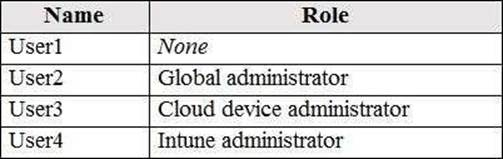

- [ ] User1 only.
- [ ] User1, User2, and User3 only.
- [ ] User1 and User2 only.
- [ ] User1, User2, User3, and User4.
- [ ] User2 only.

### You have an Azure subscription named Subscription1 that contains the resources in the following table You install the Web Server server role (IIS) on WM1 and VM2, and then add VM1 and VM2 to LB1. LB1 is configured as shown in the LB1 exhibit.  Rule1 is configured as shown in the Rule1 exhibit. NOTE: Each correct selection is worth one point. VML is in the same availability set as VM2.

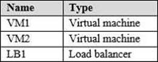
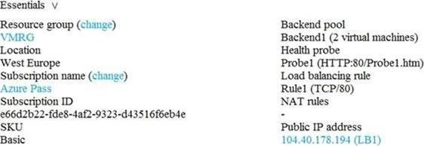
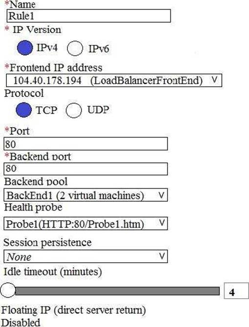

- [ ] Yes.
- [ ] No.

### You have an Azure subscription named Subscription1 that contains the resources in the following table You install the Web Server server role (IIS) on WM1 and VM2, and then add VM1 and VM2 to LB1. LB1 is configured as shown in the LB1 exhibit. Rule1 is configured as shown in the Rule1 exhibit.  NOTE: Each correct selection is worth one point. If Probel.htm is present on VM1 and VM2, LB1 will balance TCP port 80 between VM1 and VM2.

- [ ] Yes.
- [ ] No.

### You have an Azure subscription named Subscription1 that contains the resources in the following table. You install the Web Server server role (IIS) on WM1 and VM2, and then add VM1 and VM2 to LB1. LB1 is configured as shown in the LB1 exhibit. Rule1 is configured as shown in the Rule1 exhibit.  NOTE: Each correct selection is worth one point. If you delete Rule1, LB1 will balance all the requests between VM1 and VM2 for all the ports.

- [ ] Yes.
- [ ] No.

### You have a sync group named Sync1 that has a cloud endpoint. The cloud endpoint includes a file named File1.txt. You on-premises network contains servers that run Windows Server 2016. The servers are configured as shown in the following table. You add Share1 as an endpoint for Sync1. One hour later, you add Share2 as an endpoint for Sync1. On the cloud endpoint, File1.txt is overwritten by File1.txt from Sharel.

- [ ] Yes.
- [ ] No.

### You have a sync group named Sync1 that has a cloud endpoint. The cloud endpoint includes a file named File1.txt. You on-premises network contains servers that run Windows Server 2016. The servers are configured as shown in the following table. You add Share1 as an endpoint for Sync1. One hour later, you add Share2 as an endpoint for Sync1. On Server1, Filel.txt is overwritten by File1.txt from the cloud endpoint.

- [ ] Yes.
- [ ] No.

### You have a sync group named Sync1 that has a cloud endpoint. The cloud endpoint includes a file named File1.txt. You on-premises network contains servers that run Windows Server 2016. The servers are configured as shown in the following table. You add Share1 as an endpoint for Sync1. One hour later, you add Share2 as an endpoint for Sync1. File1.txt Share1 replicates to Share2.

- [ ] Yes.
- [ ] No.

### You have an Azure subscription that contains the resources shown in the following table. The Not allowed resources types Azure policy is assigned to RG1 and uses the following parameters: In RG1, you need to create a new virtual machine named VM2, and then connect the VM2 to VNET1. What should you do first?

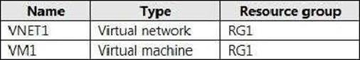

- [ ] Remove Microsoft.Network/virtualNetworks from the policy.
- [ ] Create an Azure Resource Manager template.
- [ ] Remove Microsoft.Compute/virtualMachines from the policy.
- [ ] Add a subnet to VNET1.

### You have an Azure Active Directory (Azure AD) tenant named Adatum and an Azure Subscription named Subscription1. Adatum contains a group named Developers. Subscription1 contains a resource group named Dev. You need to provide the Developers group with the ability to create Azure logic apps in the Dev resource group. Solution: On Dev, you assign the Logic App Contributor role to the Developers group. Does this meet the goal?

- [ ] Yes.
- [ ] No.

### You need to meet the technical requirement for VM4. What should you create and configure?

- [ ] Azure Notification Hub.
- [ ] Azure Event Hub.
- [ ] Azure Logic App.
- [ ] Azure services Bus.

### You need to the appropriate sizes for the Azure virtual for Server2. What should you do?

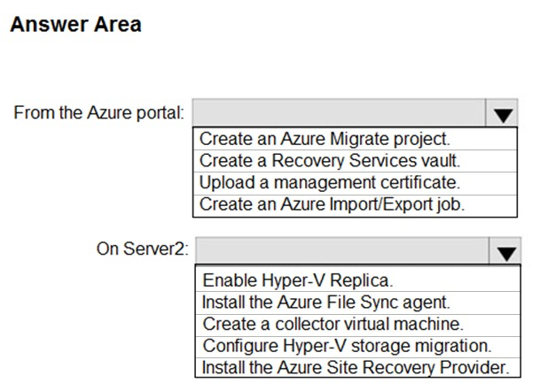

- [ ] Box 1: Create a Recovery Services vault. Box 2: Install the Azure Site Recovery Provider.
- [ ] Box 1: Create an Azure Migrate project. Box 2: Create a collector virtual machine.
- [ ] Box 1: Create an Azure Import/Export job. Box 2: Install the Azure File Sync agent.
- [ ] Box 1: Upload a management certificate.Box 2: Enable Hyper-V Replica.

### You have an Azure subscription that contains an Azure Storage account named storage1 and the users shown in the following table. You plan to monitor storage1 and to configure email notifications for the signals shown in the following table. You need to identify the minimum number of alert rules and action groups required for the planned monitoring. How many alert rules and action groups should you identify?

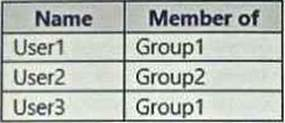
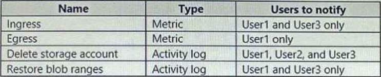
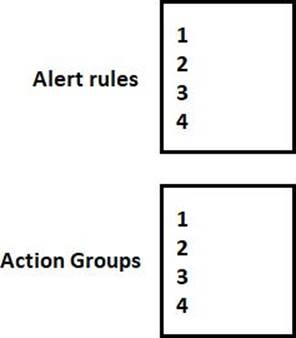

- [ ] Alert rules: 4. Action groups: 4.
- [ ] Alert rules: 3. Action groups: 1.
- [ ] Alert rules: 2. Action groups: 1.
- [ ] Alert rules: 4. Action groups: 3.

### You have an Azure Active Directory (Azure AD) tenant named contoso.onmicrosoft.com. The User administrator role is assigned to a user named Admin1. An external partner has a Microsoft account that uses the user1@outlook.com sign in.Admin1 attempts to invite the external partner to sign in to the Azure AD tenant and receives the following error message: 'Unable to invite user user1@outlook.com C Generic authorization exception.' You need to ensure that Admin1 can invite the external partner to sign in to the Azure AD tenant. What should you do?

- [ ] From the Roles and administrators blade, assign the Security administrator role to Admin1.
- [ ] From the Organizational relationships blade, add an identity provider.
- [ ] From the Custom domain names blade, add a custom domain.
- [ ] From the Users blade, modify the External collaboration settings.

### You have an Azure subscription that contains an Azure Active Directory (Azure AD) tenant named contoso.com and an Azure Kubernetes Service (AKS) cluster named AKS1. An administrator reports that she is unable to grant access to AKS1 to the users in contoso.com. You need to ensure that access to AKS1 can be granted to the contoso.com users. What should you do first?

- [ ] From contoso.com, modify the Organization relationships settings.
- [ ] From contoso.com, create an OAuth 2.0 authorization endpoint.
- [ ] Recreate AKS1.
- [ ] From AKS1, create a namespace.

### You need to configure the Device settings to meet the technical requirements and the user requirements. Which two settings should you modify?

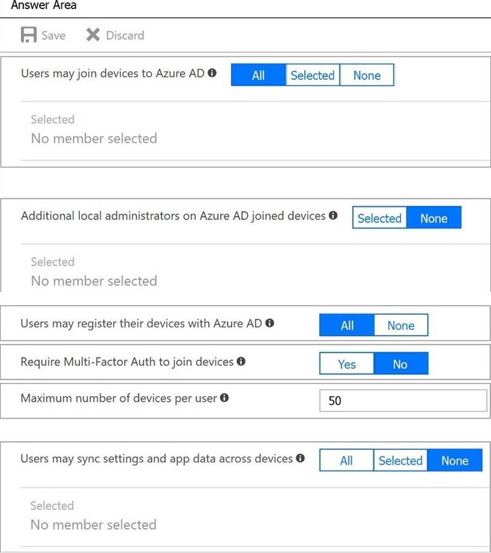

- [ ] Box 1: all. Box 2: None. Box 3: All. Box 4: Yes. Box 5: None.
- [ ] Box 1: selected. Box 2: Selected. Box 3: None. Box 4: Yes. Box 5: All.
- [ ] Box 1: None. Box 2: None. Box 3: All. Box 4: No. Box 5: Selected.
- [ ] Box 1: . Box 2: . Box 3: . Box 4: . Box 5: .???

### You need to meet the connection requirements for the New York office. What should you do?

- [ ] From the Azure portal: Create an ExpressRoute circuit only.  In the New York office: Deploy a DirectAccess server.
- [ ] From the Azure portal: Create a virtual network gateway only.  In the New York office: Implement a Web Application Proxy.
- [ ] From the Azure portal: Create a virtual network gateway and a local network gateway. In the New York office: Configure a site-to-site VPN connection.
- [ ] From the Azure portal: Create a virtual network gateway and an on-premises data gateway. In the New York office: Implement a Web Application Proxy.

### You have an Azure subscription named Subscription1 that contains the resources shown in the following table. In storage1, you create a blob container named blob1 and a file share named share1. Which resources can be backed up to Vault1 and Vault2?

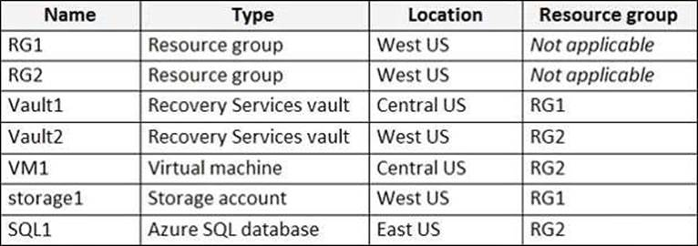
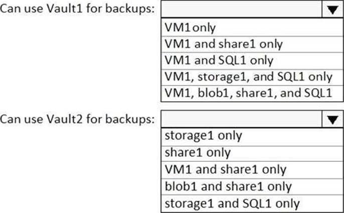

- [ ] Box 1: VM1only  Box 2: share1 only.
- [ ] Box 1: VM1 and sharel only  Box 2: VM1 and sharel only.
- [ ] Box 1: VM1 and SQL1 only  Box 2: blob1 and share1 only.
- [ ] Box 1: VM1, storagel, and SQL1 only  Box 2: ‘storagel and SQL1 only.
- [ ] Box 1: VM1, blob1, sharel, and SQL1 Box 2: VM1 and sharel only.

### You have an Azure subscription that contains a storage account named account1. You plan to upload the disk files of a virtual machine to account1 from your on-premises network. The on-premises network uses a public IP address space of 131.107.1.0/24. You plan to use the disk files to provision an Azure virtual machine named VM1. VM1 will be attached to a virtual network named VNet1. VNet1 uses an IP address space of 192.168.0.0/24. You need to configure account1 to meet the following requirements: Ensure that you can upload the disk files to account1. Ensure that you can attach the disks to VM1. Prevent all other access to account1. Which two actions should you perform? Each correct selection presents part of the solution.

- [ ] From the Firewalls and virtual networks blade of account1, add the 131.107.1.0/24 IP address range.
- [ ] From the Firewalls and virtual networks blade of account1, select Selected networks.
- [ ] From the Firewalls and virtual networks blade of acount1, add VNet1.
- [ ] From the Firewalls and virtual networks blade of account1, select Allow trusted Microsoft services to access this storage account. From the Service endpoints blade of VNet1, add a service endpoint.
- [ ] From the Service endpoints blade of VNet1, add a service endpoint.

### You discover that VM3 does NOT meet the technical requirements. You need to verify whether the issue relates to the NSGs. What should you use?

- [ ] Diagram in VNet1.
- [ ] Security recommendations in Azure Advisor.
- [ ] Diagnostic settings in Azure Monitor.
- [ ] Diagnose and solve problems in Traffic Manager ProfilesIP flow verify in Azure Network Watcher.
- [ ] IP flow verify in Azure Network Watcher.

### You have a computer named Computer1 that has a point-to-site VPN connection to an Azure virtual network named VNet1. The point-to-site connection uses a self-signed certificate. From Azure, you download and install the VPN client configuration package on a computer named Computer2. You need to ensure that you can establish a point-to-site VPN connection to VNet1 from Computer2. Solution: On Computer2, you set the Startup type for the IPSec Policy Agent service to Automatic. Does this meet the goal?

- [ ] Yes.
- [ ] No.

### You have an Azure virtual machine named VM1. The network interface for VM1 is configured as shown in the exhibit. You deploy a web server on VM1, and then create a secure website that is accessible by using the HTTPS protocol VM1 is used as a web server only. You need to ensure that users can connect to the website from the Internet. What should you do?

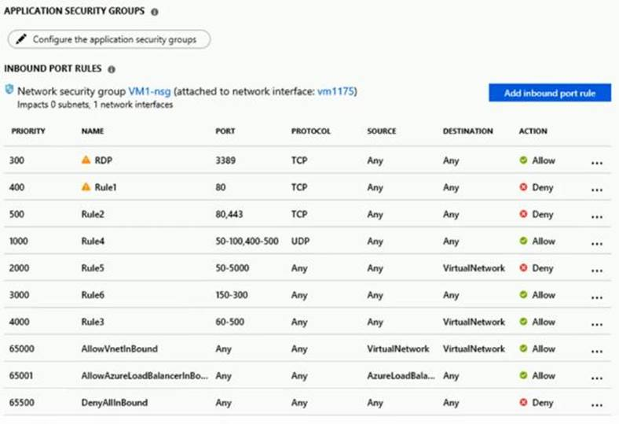

- [ ] Change the priority of Rule3 to 450.
- [ ] Change the priority of Rule6 to 100.
- [ ] DeleteRule1.
- [ ] Create a new inbound rule that allows TCP protocol 443 and configure the protocol to have a priority of 501.
- [ ] For Rule5, change the Action to Allow and change the priority to 401.

### You have an azure subscription named Subscription that contains the resource groups shown in the following table. In RG1, you create a virtual machine named VM1 in the East Asia location. You plan to create a virtual network named VNET1. You need to create VNET, and then connect VM1 to VNET1. What are two possible ways to achieve this goal? Each correct answer presents a complete a solution.

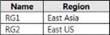

- [ ] Create VNET1 in RG2, and then set East Asia as the location.
- [ ] Create VNET1 in a new resource group in the West US location, and then set West US as the location.
- [ ] Create VNET1 in RG1, and then set East Asia as the location.
- [ ] Create VNET1 in RG1, and then set East US as the location.
- [ ] Create VNET1 in RG2, and then set East US as the location.

### You need to resolve the licensing issue before you attempt to assign the license again. What should you do?

- [ ] From the Groups blade, invite the user accounts to a new group.
- [ ] From the Profile blade, modify the usage location.
- [ ] From the Directory role blade, modify the directory role.

### Your on-premises network contains an Active Directory domain named adatum.com that is synced to Azure Active Directory (Azure AD). Password writeback is disabled. In adatum.com, you create the users shown in the following table.

- [ ] User2 only.
- [ ] User1 and User3 only.
- [ ] User1, User2, and User3.
- [ ] User2 and User3 only.
- [ ] User1 only.

### You need to resolve the Active Directory issue. What should you do?

- [ ] From Active Directory Users and Computers, select the user accounts, and then modify the User Principal Name value.
- [ ] Run idfix.exe, and then use the Edit action.
- [ ] From Active Directory Domains and Trusts, modify the list of UPN suffixes.
- [ ] From Azure AD Connect, modify the outbound synchronization rule.

### You have an Azure Active Directory (Azure AD) tenant named adatum.com. Adatum.com contains the groups in the following table. You create two user accounts that are configured as shown in the following table. To which groups do User1 and User2 belong?

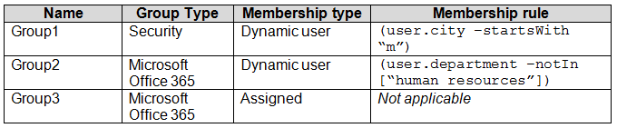
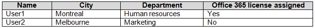
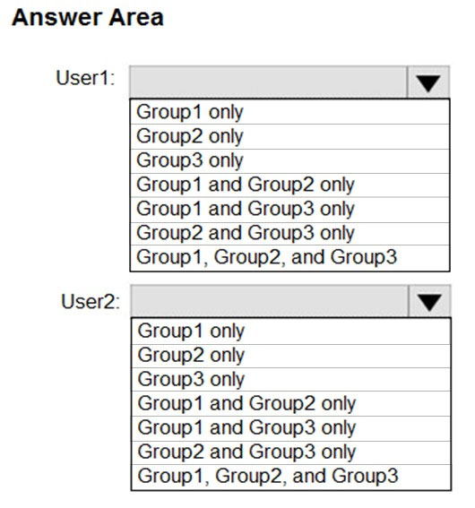

- [ ] Box 1: Group1 only. Box 2: Group1 and Group2 only.
- [ ] Box 1: Group2 only. Box 2: Group1 only.
- [ ] Box 1: Group3 only. Box 2: Group2 only.
- [ ] Box 1: Groupl and Group3 only. Box 2: Group1, Group2, and Group3.
- [ ] Box 1: Groupi, Group2, and Group3. Box 2: Group2 and Group3 only.

### You have an Azure subscription that contains an Azure Availability Set named WEBPROD-AS-USE2 as shown in the following exhibit. You have an Azure subscription named Subscription1 that contains the resources shown in the following table.

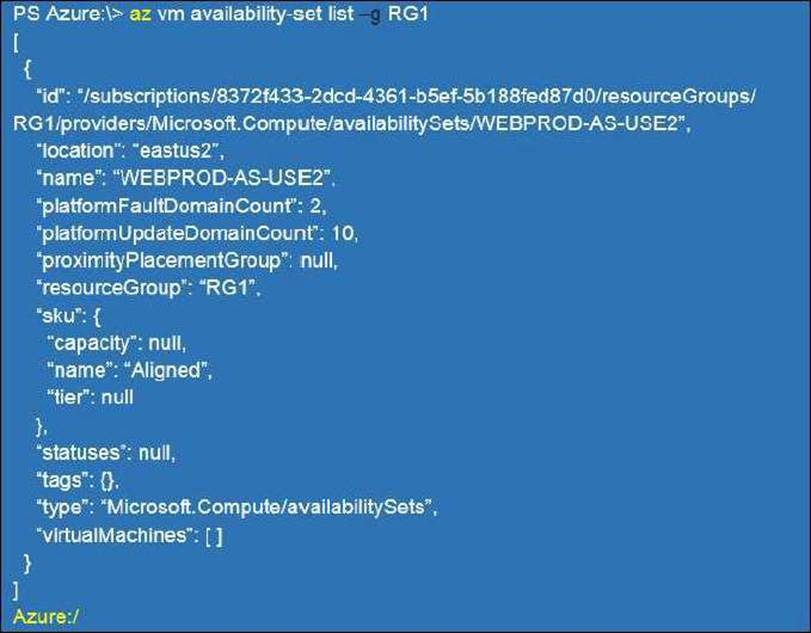
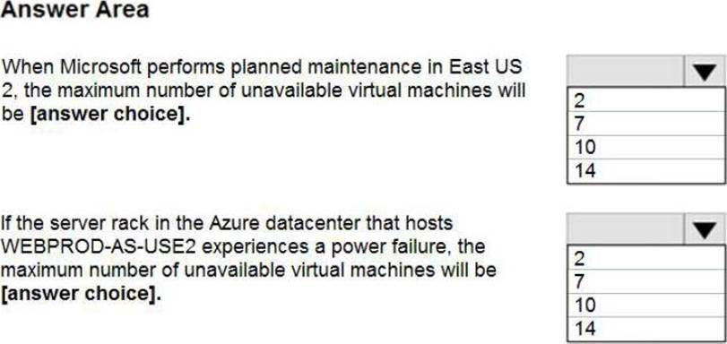

- [ ] When Microsoft performs planned maintenance in East US 2, the maximum number of unavailable virtual machines will be: 14. If the server rack in the Azure datacenter that hosts WEBPROD-AS-USE2 experiences a power failure, the maximum number of unavailable virtual machines will be: 2.
- [ ] When Microsoft performs planned maintenance in East US 2, the maximum number of unavailable virtual machines will be: 10. If the server rack in the Azure datacenter that hosts WEBPROD-AS-USE2 experiences a power failure, the maximum number of unavailable virtual machines will be: 10.
- [ ] When Microsoft performs planned maintenance in East US 2, the maximum number of unavailable virtual machines will be: 7. If the server rack in the Azure datacenter that hosts WEBPROD-AS-USE2 experiences a power failure, the maximum number of unavailable virtual machines will be: 14.
- [ ] When Microsoft performs planned maintenance in East US 2, the maximum number of unavailable virtual machines will be: 2. If the server rack in the Azure datacenter that hosts WEBPROD-AS-USE2 experiences a power failure, the maximum number of unavailable virtual machines will be: 7.

### You have an app named App1 that is installed on two Azure virtual machines named VM1 and VM2. Connections to App1 are managed by using an Azure Load Balancer. The effective network security configurations for VM2 are shown in the following exhibit. You discover that connections to App1 from 131.107.100.50 over TCP port 443 fail. You verify that the Load Balancer rules are configured correctly. You need to ensure that connections to App1 can be established successfully from 131.107.100.50 over TCP port 443. Solution: You create an inbound security rule that allows any traffic from the AzuteLoadBalancer source and has a cost of 150. Does this meet the goal?

- [ ] Yes.
- [ ] No.

### You have an Azure subscription that contains the following resources: A virtual network that has a subnet named Subnet1. Two network security groups (NSGs) named NSG-VM1 and NSG-Subnet1. A virtual machine named VM1 that has the required Windows Server configurations to allow Remote Desktop connections NSG-Subnet1 has the default inbound security rules only. NSG-VM1 has the default inbound security rules and the following custom inbound security rule: Priority: 100. Source: Any. Source port range: *. Destination: *. Destination port range: 3389. Protocol: UDP. Action: Allow VM1 connects to Subnet1. NSG1-VM1 is associated to the network interface of VM1. NSG-Subnet1 is associated to Subnet1. You need to be able to establish Remote Desktop connections from the internet to VM1. Solution: You add an inbound security rule to NSG-Subnet1 that allows connections from the Any source to the VirtualNetwork destination for port range 3389 and uses the TCP protocol. You remove NSG-VM1 from the network interface of VM1. Does this meet the goal?

- [ ] Yes.
- [ ] No.

### You have an Azure subscription that contains the following resources: 100 Azure virtual machines. 20 Azure SQL databases. 50 Azure file shares You need to create a daily backup of all the resources by using Azure Backup. What is the minimum number of backup policies that you must create?

- [ ] 1.
- [ ] 2.
- [ ] 3.
- [ ] 150.
- [ ] 170.

### Litware, Ltd. is a consulting company that has a main office in Montreal and two branch offices in Seattle and New York. The Montreal office has 2,000 employees. The Seattle office has 1,000 employees. The New York office has 200 employees. All the resources used by Litware are hosted on-premises. Litware creates a new Azure subscription. The Azure Active Directory (Azure AD) tenant uses a domain named Litware.onmicrosoft.com. The tenant uses the P1 pricing tier. The network contains an Active Directory forest named Litware.com. All domain controllers are configured as DNS servers and host the Litware.com DNS zone. Litware has finance, human resources, sales, research, and information technology departments. Each department has an organizational unit (OU) that contains all the accounts of that respective department. All the user accounts have the department attribute set to their respective department. New users are added frequently. Litware.com contains a user named User1. All the offices connect by using private links. Litware has data centers in the Montreal and Seattle offices. Each data center has a firewall that can be configured as a VPN device. All infrastructure servers are virtualized. The virtualization environment contains the servers in the following table. The network security team implements several network security groups (NSGs). Litware plans to implement the following changes: Deploy Azure ExpressRoute to the Montreal office. Migrate the virtual machines hosted on Server1 and Server2 to Azure. Synchronize on-premises Active Directory to Azure Active Directory (Azure AD). Migrate App1 and App2 to two Azure web apps named webApp1 and WebApp2. Litware must meet the following technical requirements: Ensure that WebApp1 can adjust the number of instances automatically based on the load and can scale up to five instance*. Ensure that VM3 can establish outbound connections over TCP port 8080 to the applications servers in the Montreal office. Ensure that routing information is exchanged automatically between Azure and the routers in the Montreal office. Enable Azure Multi-Factor Authentication (MFA) for the users in the finance department only. Ensure that webapp2.azurewebsites.net can be accessed by using the name app2.Litware.com. Connect the New Your office to VNet1 over the Internet by using an encrypted connection. Create a workflow to send an email message when the settings of VM4 are modified. Create a custom Azure role named Role1 that is based on the Reader role. Minimize costs whenever possible. You need to implement Role1. Which command should you run before you create Role1?

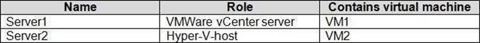
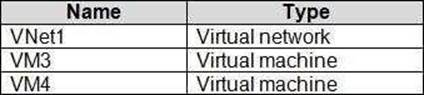
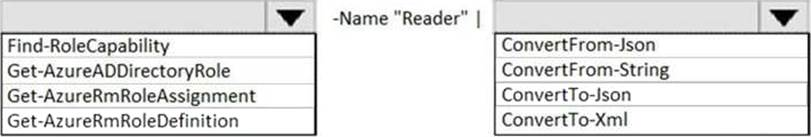

- [ ] Box 1: Find-RoleCapability. Box 2: ConvertFrom-Json.
- [ ] Box 1: Get-AzRoleDefinition. Box 2: ConvertTo-Json.
- [ ] Box 1: Get-AzRoleDefinition. Box 2: ConvertTo-Xml.
- [ ] Box 1: Get-AzResourceProvider. Box 2: ConvertTo-Xml.

### You have an Azure subscription that contains the public load balancers shown in the following table. You create virtual machines in Subscription1 as shown in the following table. You plan to use Vault1 for the backup of as many virtual machines as possible. Which virtual machines can be backed up to Vault1?

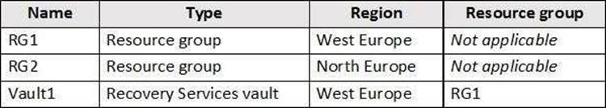
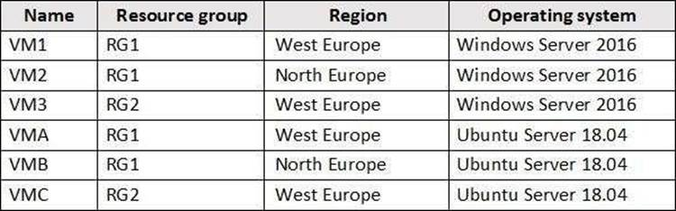

- [ ] VM1, VM3, VMA, and VMC only.
- [ ] VM1 and VM3 only.
- [ ] VM1, VM2, VM3, VMA, VMB, and VMC.
- [ ] VM1 only.
- [ ] VM3 and VMC only.

### You have an Azure virtual machine named VM1. Azure collects events from VM1. You are creating an alert rule in Azure Monitor to notify an administrator when an error is logged in the System event log of VM1. You need to specify which resource type to monitor. What should you specify?

- [ ] Metric alert.
- [ ] Azure Log Analytics workspace.
- [ ] Virtual machine.
- [ ] Virtual machine extension.

### You have an Azure virtual machine named VM1 that runs Windows Server 2019. You sign in to VM1 as a user named User 1 and perform the following actions: Create files on drive C. Create files on drive D. Modify the screen saver timeout. Change the desktop background. You plan to redeploy VM1. Which changes will be lost after you redeploy VM1?

- [ ] Modified screen saver timeout.
- [ ] New desktop background.
- [ ] New files on drive D.
- [ ] New files on drive C.

### You have an Azure subscription that contains the public load balancers shown in the following table.You plan to create six virtual machines and to load balancer requests to the virtual machines. Each load balancer will load balance three virtual machines. You need to create the virtual machines for the planned solution. How should you create the virtual machines?

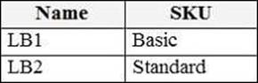
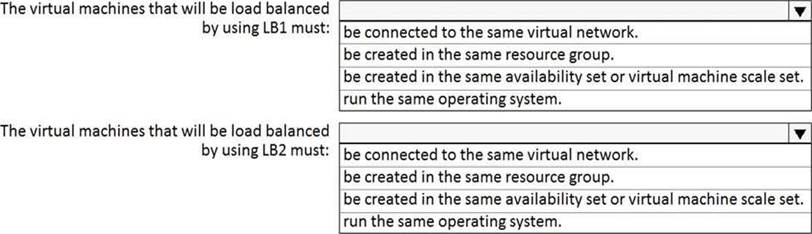

- [ ] The virtual machines that will be load balanced by using LB1 must: be created in the same availability set or virtual machine scale set. The virtual machines that will be load balanced by using LB2 must: be connectedtothe same virtuainetwork.
- [ ] The virtual machines that will be load balanced by using LB1 must: run the same operating system. The virtual machines that will be load balanced by using LB2 must: be created in the same resource group.
- [ ] The virtual machines that will be load balanced by using LB1 must: be created in the same resource group. The virtual machines that will be load balanced by using LB2 must: run the same operating system.
- [ ] The virtual machines that will be load balanced by using LB1 must: be connected to the same virtual network. The virtual machines that will be load balanced by using LB2 must: be connectedtothe same virtual network.

### You have an Azure Active Directory (Azure AD) tenant named contoso.com that is synced to an Active Directory domain. The tenant contains the users shown in the following table. The users have the attributes shown in the following table. You need to ensure that you can enable Azure Multi-Factor Authentication (MFA) for all four users. Solution: You add an office phone number for User2. Does this meet the goal?

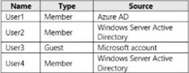
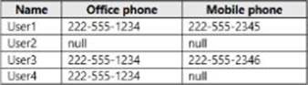

- [ ] Yes.
- [ ] No.

### You have the Azure virtual machines shown in the following table. A DNS service is installed on VM1. You configure the DNS server settings for each virtual network as shown in the following exhibit. You need 10 ensure that all the virtual machines can resolve DNS names by using the DNS service on VM1. What should you do?

[Question 37 part 1](images/question37_1.jpg)
[Question 37 part 2](images/question37_2.jpg)

- [ ] Add service endpoints on VNET2 and VNET3.
- [ ] Configure peering between VNE11, VNETT2, and VNET3.
- [ ] Configure a conditional forwarder on VM1.
- [ ] Add service endpoints on VNET1.

### You deploy an Azure Kubernetes Service (AKS) cluster that has the network profile shown in the following exhibit. Use the drop-down menus to select the answer choice that completes each statement based on the information presented in the graphic.

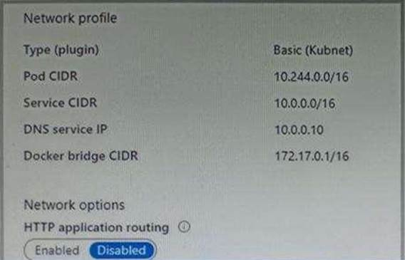
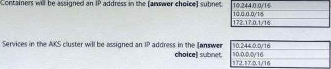

- [ ] Containers will be assigned an IP address in the [answer choice] subnet: 172.17.0.1/16. Services in the AKS cluster will be assigned an IP address in the [answer choice] subnet: 10.244.0.0/16.
- [ ] Containers will be assigned an IP address in the [answer choice] subnet: 10.244.0.0/16. Services in the AKS cluster will be assigned an IP address in the [answer choice] subnet: 10.244.0.0/16.
- [ ] Containers will be assigned an IP address in the [answer choice] subnet: 10.0.0.0/16. Services in the AKS cluster will be assigned an IP address in the [answer choice] subnet: 10.0.0.0/16.
- [ ] Containers will be assigned an IP address in the [answer choice] subnet: 10.244.0.0/16. Services in the AKS cluster will be assigned an IP address in the [answer choice] subnet: 10.0.0.0/16.

### You have peering configured as shown in the following exhibit.

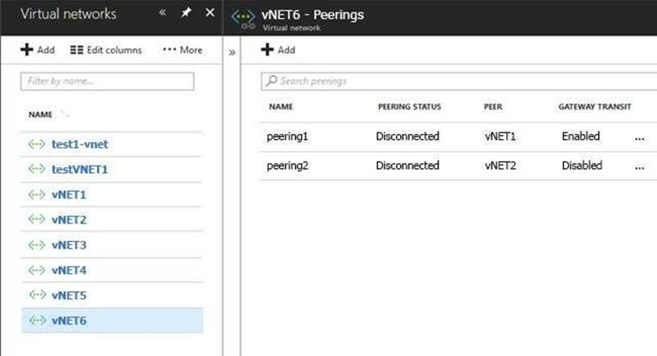
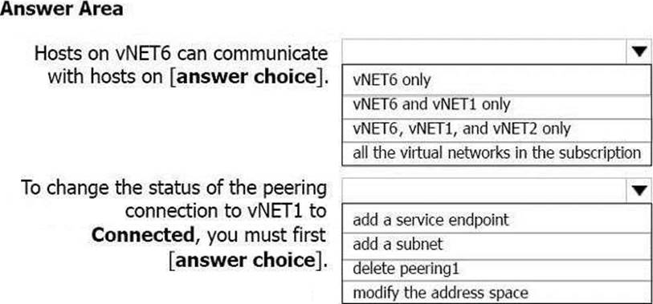

- [ ] Box 1: VNET6 only. Box 2: delete peering1.
- [ ] Box 1: VNET6, VNET1, and VvNET2 only. Box 2: add a service endpoint.
- [ ] Box 1: all the virtual networks in the subscription. Box 2: modify the address space.
- [ ] Box 1: VNET6 and vNET1 only. Box 2: add a service endpoint.

### You plan to use the Azure Import/Export service to copy files to a storage account. Which two files should you create before you prepare the drives for the import job?

- [ ] XML manifest file.
- [ ] Driveset CSV file.
- [ ] Dataset CSV file.
- [ ] PowerShell PS1 file.
- [ ] JSON configuration file.

### You have an Azure subscription that contains a web app named webapp1. You need to add a custom domain named www.contoso.com to webapp1. What should you do first?

- [ ] Upload a certificate.
- [ ] Add a connection string.
- [ ] Stop webapp1.
- [ ] Create a DNS record.

### You have an Azure virtual machine that runs Windows Server 2019 and has the following configurations: Name: VM1. Location: West US. Connected to: VNET1. Private IP address: 10.1.0.4. Public IP addresses: 52.186.85.63. DNS suffix in Windows Server: Adatum.com You create the Azure DNS zones shown in the following table. You need to identify which DNS zones you can link to VNET1 and the DNS zones to which VM1 can automatically register. Which zones should you identify?

- [ ] Box 1: Adatum.com only. Box 2: Adatum.com only.
- [ ] Box 1: The private zones only. Box 2: The private zones only.
- [ ] Box 1: Adatum.pri and adatum.com only. Box 2: Adatum.pri and adatum.com only.
- [ ] Box 1: The public zones only. Box 2: The public zones only.

### You create an Azure VM named VM1 that runs Windows Server 2019. VM1 is configured as shown in the exhibit. You need to enable Desired State Configuration for VM1. What should you do first?

- [ ] Configure a DNS name for VM1.
- [ ] Start VM1.
- [ ] Connect to VM1.
- [ ] Capture a snapshot of VM1.

### You have an Azure subscription that contains the resources shown in the following table. You need to create a network interface named NIC1. In which location can you create NIC1?
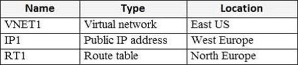
- [ ] East US and North Europe only.
- [ ] East US and West Europe only.
- [ ] East US, West Europe, and North Europe.
- [ ] East US only.

### You need to meet the user requirement for Admin1. What should you do?

- [ ] From the Subscriptions blade, select the subscription, and then modify the Properties.
- [ ] From the Subscriptions blade, select the subscription, and then modify the Access control (IAM) settings.
- [ ] From the Azure Active Directory blade, modify the Properties.
- [ ] From the Azure Active Directory blade, modify the Groups.

### You have an Azure subscription that contains the resources shown in the following table. VM1 and VM2 run a website that is configured as shown in the following table. LB1 is configured to balance requests to VM1 and VM2. You configure a health probe as shown in the exhibit.You need to ensure that the health probe functions correctly. What should you do?
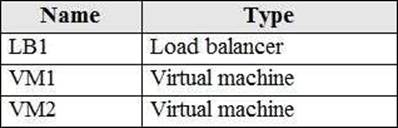
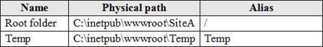
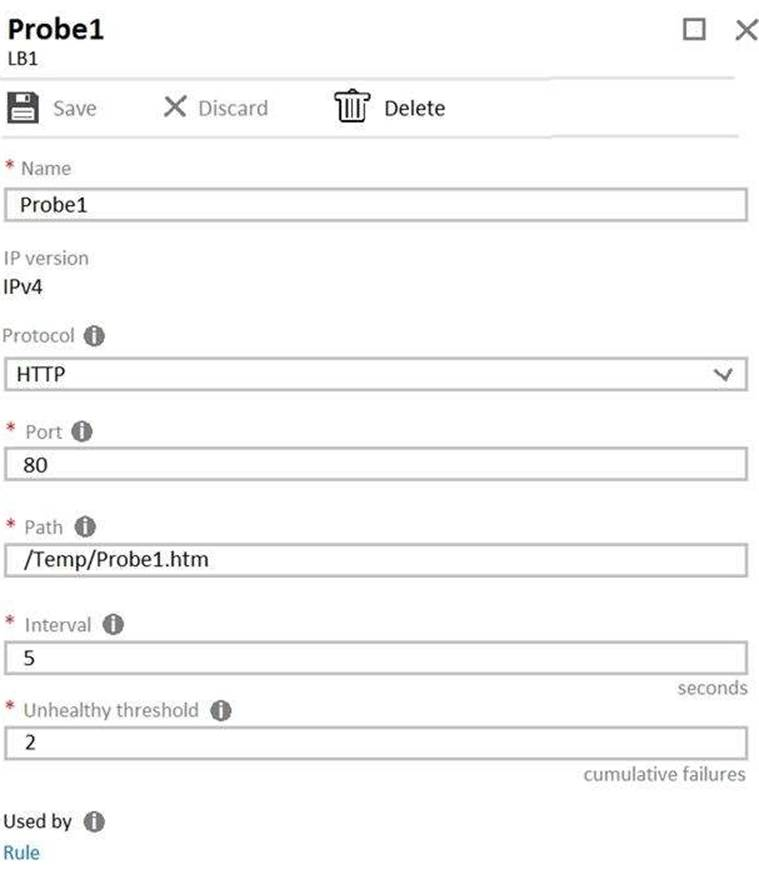
- [ ] On LB1, change the Unhealthy threshold to 65536.
- [ ] On LB1, change the port to 8080.
- [ ] On VM1 and VM2, create a file named Probe1.htm in the C:intepubwwwrootTemp folder.
- [ ] On VM1 and VM2, create a file named Probe1.htm in the C:intepubwwwrootSiteATemp folder.

### You have an Azure subscription that contains the following resources: A virtual network that has a subnet named Subnet1. Two network security groups (NSGs) named NSG-VM1 and NSG-Subnet1. A virtual machine named VM1 that has the required Windows Server configurations to allow Remote Desktop connections NSG-Subnet1 has the default inbound security rules only. NSG-VM1 has the default inbound security rules and the following custom inbound security rule:. Priority: 100. Source: Any. Source port range: *. Destination: *. Destination port range: 3389. Protocol: UDP. Action: Allow VM1 connects to Subnet1. NSG1-VM1 is associated to the network interface of VM1. NSG-Subnet1 is associated to Subnet1. You need to be able to establish Remote Desktop connections from the internet to VM1. Solution: You add an inbound security rule to NSG-Subnet1 that allows connections from the Internet source to the VirtualNetwork destination for port range 3389 and uses the UDP protocol. Does this meet the goal?

- [ ] Yes.
- [ ] No.

### Topic 4, Misc. Questions Set A You have an Azure subscription that contains the resources shown in the following table. All virtual machines run Windows Server 2016. On VM1, you back up a folder named Folder1 as shown in the following exhibit. You plan to restore the backup to a different virtual machine. You need to restore the backup to VM2. What should you do first?
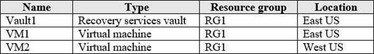

- [ ] From VM2, install the Microsoft Azure Recovery Services Agent.
- [ ] From VM1, install the Windows Server Backup feature.
- [ ] From VM2, install the Windows Server Backup feature.
- [ ] From VM1, install the Microsoft Azure Recovery Services Agent.

### You have an Azure virtual machine named VM1 that runs Windows Server 2016. You need to create an alert in Azure when more than two error events are logged to the System log on VM1 within an hour. Solution: You create an event subscription on VM1. You create an alert in Azure Monitor and specify VM1 as the source. Does this meet the goal?

- [ ] Yes.
- [ ] No.

### You have an Azure web app named App1. App1 has the deployment slots shown in the following table: In webapp1-test, you test several changes to App1. You back up App1. You swap webapp1-test for webapp1-prod and discover that App1 is experiencing performance issues. You need to revert to the previous version of App1 as quickly as possible. What should you do?

- [ ] Redeploy App1.
- [ ] Swap the slots.
- [ ] Clone App1.
- [ ] Restore the backup of App1.

### You have an Azure subscription that contains the resources shown in the following table. VM1 connects to VNET1. You need to connect VM1 to VNET2. Solution: You create a new network interface, and then you add the network interface to VM1. Does this meet the goal?
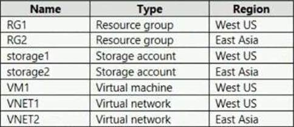
- [ ] Yes.
- [ ] No.

### You have an Azure subscription that contains the resources shown in the following table. VM1 connects to VNET1. You need to connect VM1 to VNET2. Solution: You delete VM1. You recreate VM1, and then you create a new network interface for VM1. Does this meet the goal?

- [ ] Yes.
- [ ] No.

### You have an Azure subscription that contains the resources shown in the following table. VM1 connects to VNET1. You need to connect VM1 to VNET2. Solution: You turn off VM1, and then you add a new network interface to VM1. Does this meet the goal?

- [ ] Yes.
- [ ] No.

### You need to prepare the environment to meet the authentication requirements. Which two actions should you perform?

- [ ] Azure Active Directory (AD) Identity Protection and an Azure policy.
- [ ] Recovery Services vault and a backup policy.
- [ ] Azure Key Vault and an access policy.
- [ ] Azure Storage account and an access policy.

### Note: This question is part of a series of questions that present the same scenario. Each question in the series contains a unique solution that might meet the stated goals. Some question sets might have more than one correct solution, while others might not have a correct solution. You have an Azure subscription named Subscription1. Subscription1 contains a resource group named RG1. RG1 contains resources that were deployed by using templates. You need to view the date and time when the resources were created in RG1. Solution: From the RG1 blade, you click Deployments. Does this meet the goal?

- [ ] Yes.
- [ ] No.

### You download an Azure Resource Manager template based on an existing virtual machine. The template will be used to deploy 100 virtual machines. You need to modify the template to reference an administrative password. You must prevent the password from being stored in plain text.

- [ ] Azure Active Directory (AD) Identity Protection and an Azure policy.
- [ ] a Recovery Services vault and a backup policy.
- [ ] an Azure Key Vault and an access policy.
- [ ] an Azure Storage account and an access policy.

### You need to prepare the environment to meet the authentication requirements. Which two actions should you perform?

- [ ] Allow inbound TCP port 8080 to the domain controllers in the Miami office.
- [ ] Add http://autogon.microsoftazuread-sso.com to the intranet zone of each client computer in the Miami office.
- [ ] Join the client computers in the Miami office to Azure.
- [ ] Install the Active Directory Federation Services (AD FS) role on a domain controller in the Miami office.
- [ ] Install Azure AD Connect on a server in the Miami office and enable Pass-through Authentication.

### You have an Azure subscription named Subscription1 that contains the resources shown in the following table. VM1 connects to a virtual network named VNET2 by using a network interface named NIC1. You need to create a new network interface named NIC2 for VM1. Solution: You create NIC2 in RG2 and Central US. Does this meet the goal?
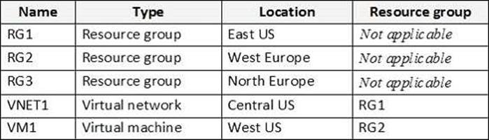
- [ ] Yes.
- [ ] No.

### You manage two Azure subscriptions named Subscription1 and Subscription2. Subscription1 has following virtual networks: The virtual networks contain the following subnets: Subscription2 contains the following virtual network: Name: VNETA. Address space: 10.10.128.0/17. Location: Canada Central VNETA contains the following subnets: A Site-to-Site connection can be established.
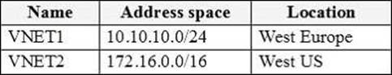
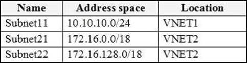

- [ ] Yes.
- [ ] No.

### You manage two Azure subscriptions named Subscription1 and Subscription2. Subscription1 has following virtual networks: The virtual networks contain the following subnets: Subscription2 contains the following virtual network: Name: VNETA. Address space: 10.10.128.0/17. Location: Canada Central VNETA contains the following subnets: VNET1 and VNET2 can be peered.

- [ ] Yes.
- [ ] No.

### You manage two Azure subscriptions named Subscription1 and Subscription2. Subscription1 has following virtual networks: The virtual networks contain the following subnets: Subscription2 contains the following virtual network: Name: VNETA. Address space: 10.10.128.0/17. Location: Canada Central VNETA contains the following subnets:VNET1 and VNETA can be peered.

- [ ] Yes.
- [ ] No.

### You have an Azure subscription that contains the resources in the following table. VM1 and VM2 are deployed from the same template and host line-of-business applications accessed by using Remote Desktop. You configure the network security group (NSG) shown in the exhibit. You need to prevent users of VM1 and VM2 from accessing websites on the Internet. What should you do?

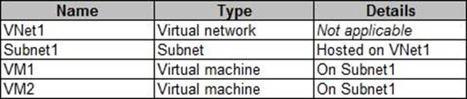
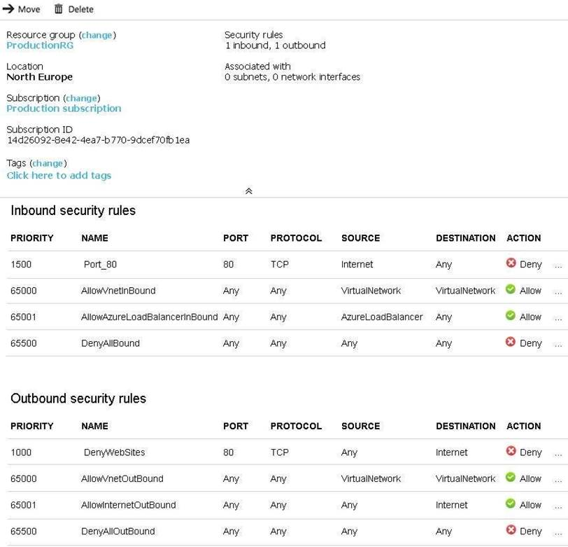

- [ ] Associate the NSG to Subnet1.
- [ ] Disassociate the NSG from a network interface.
- [ ] Change the DenyWebSites outbound security rule.
- [ ] Change the Port_80 inbound security rule.

### You have an Azure subscription named Subcription1 that contains a resource group named RG1. In RG1. you create an internal load balancer named LB1 and a public load balancer named 162. You need to ensure that an administrator named Admin 1 can manage LB1 and LB2. The solution must follow the principle of least privilege. Which role should you assign to Admin1 for each task?
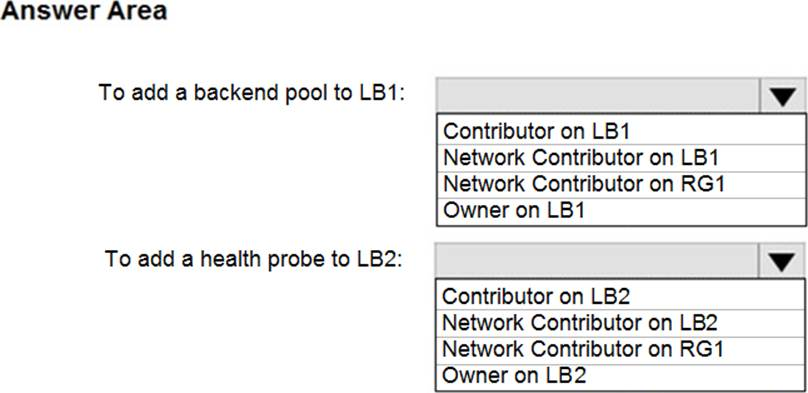
- [ ] Box 1: Network Contributor on RG1. Box 2: Network Contributor on RG1.
- [ ] Box 1: Owner on LB1. Box 2: Owneron LB2.
- [ ] Box 1: Contributor on LB1. Box 2: Contributor on LB2.
- [ ] Box 1: Network Contributor on LB1. Box 2: Network Contributor on LB2.

### You plan to deploy several Azure virtual machines that will run Windows Server 2019 in a virtual machine scale set by using an Azure Resource Manager template. You need to ensure that NGINX is available on all the virtual machines after they are deployed. What should you use?

- [ ] Desired State Configuration (DSC) extension.
- [ ] Publish-AzVMDscConfigurationCmdlet.
- [ ] Microsoft Intune device configuration profile.
- [ ] Deployment Center in Azure App Service.

### You have an Azure subscription named Subscription1 that contains the resources shown in the following table. You plan to configure Azure Backup reports for Vault1. You are configuring the Diagnostics settings for the AzureBackupReports log. Which storage accounts and which Log Analytics workspaces can you use for the Azure Backup reports of Vault1?
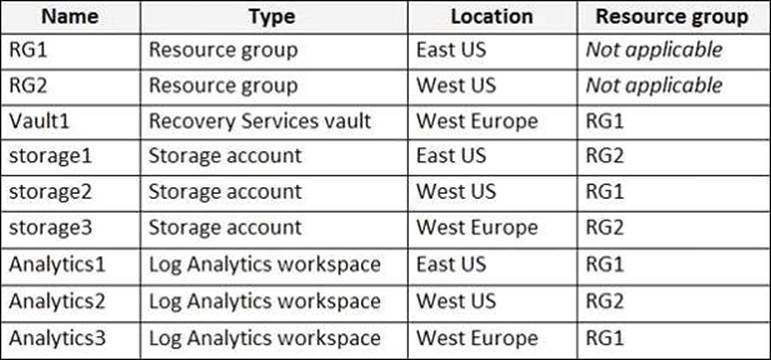
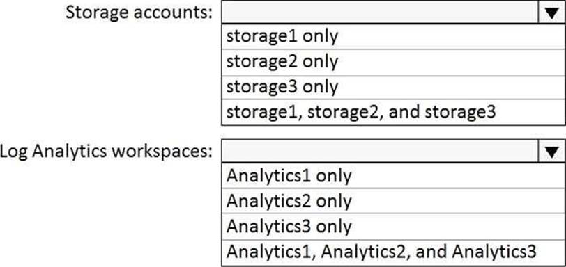
- [ ] Box 1: storage3 only. Box 2: Analytics3 only.
- [ ] Box 1: storage1, storage2, and storage3. Box 2: Analytics1 only.
- [ ] Box 1: storage1 only. Box 2: Analytics2 only.
- [ ] Box 1: storage2 only. Box 2: Analytics1, Analytics2, and Analytics3.

### You have several Azure virtual machines on a virtual network named VNet1. You configure an Azure Storage account as shown in the following exhibit.
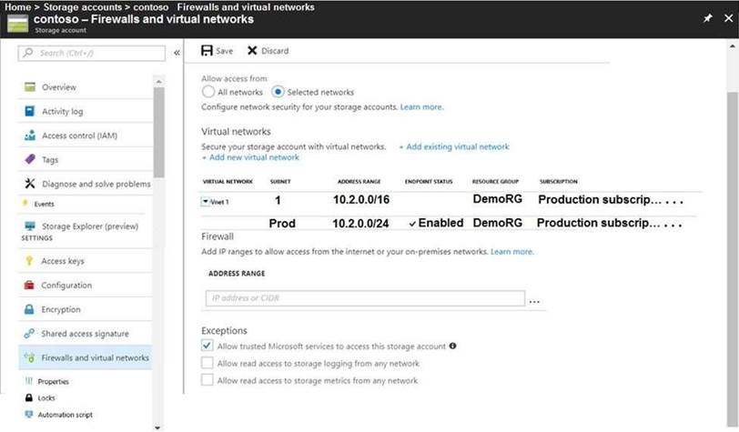
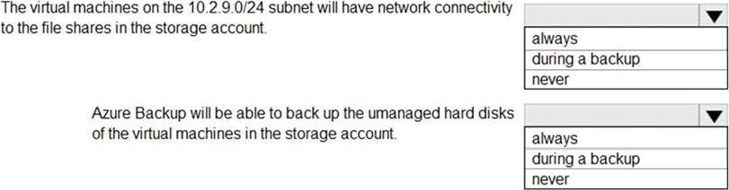
- [ ] Box 1: never. Box 2:never.
- [ ] Box 1: never. Box 2: during a backup.
- [ ] Box 1: always. Box 2: never.
- [ ] Box 1: . Box 2: .???

### You have an Azure subscription that contains an Azure file share. You have an on-premises server named Server1 that runs Windows Server 2016. You plan to set up Azure File Sync between Server1 and the Azure file share. You need to prepare the subscription for the planned Azure File Sync. Which two actions should you perform in the Azure subscription?
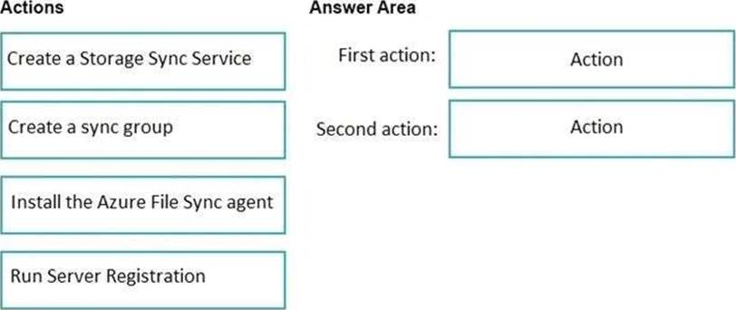
- [ ] Box 1: Create a Storage Sync Service. Box 2: Create a sync group.
- [ ] Box 1: Create a sync group. Box 2: Install the Azure File Sync agend.
- [ ] Box 1: Run Server Registration. Box 2: Create a Storage Sync Service.
- [ ] Box 1: . Box 2: .???

### You have an Azure subscription that contains the following users in an Azure Active Directory tenant named contoso.onmicrosoft.com: User1 creates a new Azure Active Directory tenant named external.contoso.onmicrosoft.com. You need to create new user accounts in external.contoso.com.onmicrosoft.com. Solution: You instruct User3 to create the user accounts.

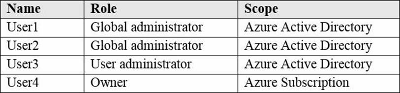

- [ ] Yes.
- [ ] No.

### You create an Azure subscription named Subscription1 and an associated Azure Active Directory (Azure AD) tenant named Tenant1. Tenant1 contains the users in the following table. You need to add an Azure AD Privileged Identity Management application to Tenant1. Which account can you use?

- [ ] Admin3@contoso.onmicrosoft.com.
- [ ] Admin1@contoso.onmicrosoft.com.
- [ ] Admin2@contoso.onmicrosoft.com.
- [ ] ContosoAdmin1@hotmail.com.

### You have an Active Directory domain named contoso.com that contains the objects shown in the following table. The groups have the memberships shown in the following table. OU1 and OU2 are synced to Azure Active Directory (Azure AD). You modify the synchronization settings and remove OU1 from synchronization. You sync Active Directory and Azure AD. Which objects are in Azure AD?

- [ ] User4 and Group2 only.
- [ ] User2, Group1, User4, and Group2 only.
- [ ] User1, User2, Group1, User4, and Group2 only.
- [ ] User1, User2, User3, User4, Group1, and Group2.

### Humongous Insurance is an insurance company that has three offices in Miami, Tokoyo, and Bangkok. Each has 5000 users. Active Directory Environment Humongous Insurance has a single-domain Active Directory forest named humongousinsurance.com. The functional level of the forest is Windows Server 2012. You recently provisioned an Azure Active Directory (Azure AD) tenant. Network Infrastructure Each office has a local data center that contains all the servers for that office. Each office has a dedicated connection to the Internet. Each office has several link load balancers that provide access to the servers. Active Directory Issue Several users in humongousinsurance.com have UPNs that contain special characters. You suspect that some of the characters are unsupported in Azure AD. Licensing Issue You attempt to assign a license in Azure to several users and receive the following error message: 'Licenses not assigned. License agreement failed for one user.' You verify that the Azure subscription has the available licenses. Requirements. Planned Changes. Humongous Insurance plans to open a new office in Paris. The Paris office will contain 1,000 users who will be hired during the next 12 months. All the resources used by the Paris office users will be hosted in Azure. Planned Azure AD Infrastructure. The on-premises Active Directory domain will be synchronized to Azure AD. All client computers in the Paris office will be joined to an Azure AD domain. Planned Azure Networking Infrastructure. You plan to create the following networking resources in a resource group named All_Resources: Default Azure system routes that will be the only routes used to route traffic A virtual network named Paris-VNet that will contain two subnets named Subnet1 and Subnet2 A virtual network named ClientResources-VNet that will contain one subnet named ClientSubnet A virtual network named AllOffices-VNet that will contain two subnets named Subnet3 and Subnet4. You plan to enable peering between Paris-VNet and AllOffices-VNet. You will enable the Use remote gateways setting for the Paris-VNet peerings. You plan to create a private DNS zone named humongousinsurance.local and set the registration network to the ClientResources-VNet virtual network. Planned Azure Computer Infrastructure. Each subnet will contain several virtual machines that will run either Windows Server 2012 R2, Windows Server 2016, or Red Hat Linux. Department Requirements. Humongous Insurance identifies the following requirements for the company's departments: Web administrators will deploy Azure web apps for the marketing department. Each web app will be added to a separate resource group. The initial configuration of the web apps will be identical. The web administrators have permission to deploy web apps to resource groups. During the testing phase, auditors in the finance department must be able to review all Azure costs from the past week. Authentication Requirements. Users in the Miami office must use Azure Active Directory Seamless Single Sign-on (Azure AD Seamless SSO) when accessing resources in Azure. You need to define a custom domain name for Azure AD to support the planned infrastructure. Which domain name should you use?

- [ ] ad.humongousinsurance.com.
- [ ] humongousinsurance.onmicrosoft.com.
- [ ] humongousinsurance.local.
- [ ] humongousinsurance.com.

### Humongous Insurance Overview Existing Environment Huongous Insurance is an insurance company that has three offices in Miami, Tokoyo, and Bangkok. Each has 5000 users. Active Directory Environment Humongous Insurance has a single-domain Active Directory forest named humongousinsurance.com. The functional level of the forest is Windows Server 2012. You recently provisioned an Azure Active Directory (Azure AD) tenant. Network Infrastructure Each office has a local data center that contains all the servers for that office. Each office has a dedicated connection to the Internet. Each office has several link load balancers that provide access to the servers. Active Directory Issue Several users in humongousinsurance.com have UPNs that contain special characters. You suspect that some of the characters are unsupported in Azure AD. Licensing Issue You attempt to assign a license in Azure to several users and receive the following error message: 'Licenses not assigned. License agreement failed for one user.' You verify that the Azure subscription has the available licenses. Requirements Planned Changes Humongous Insurance plans to open a new office in Paris. The Paris office will contain 1,000 users who will be hired during the next 12 months. All the resources used by the Paris office users will be hosted in Azure. Planned Azure AD Infrastructure The on-premises Active Directory domain will be synchronized to Azure AD. All client computers in the Paris office will be joined to an Azure AD domain. Planned Azure Networking Infrastructure You plan to create the following networking resources in a resource group named All_Resources: Default Azure system routes that will be the only routes used to route traffic A virtual network named Paris-VNet that will contain two subnets named Subnet1 and Subnet2 A virtual network named ClientResources-VNet that will contain one subnet named ClientSubnet A virtual network named AllOffices-VNet that will contain two subnets named Subnet3 and Subnet4 You plan to enable peering between Paris-VNet and AllOffices-VNet. You will enable the Use remote gateways setting for the Paris-VNet peerings. You plan to create a private DNS zone named humongousinsurance.local and set the registration network to the ClientResources-VNet virtual network. Planned Azure Computer Infrastructure Each subnet will contain several virtual machines that will run either Windows Server 2012 R2, Windows Server 2016, or Red Hat Linux. Department Requirements Humongous Insurance identifies the following requirements for the company's departments: Web administrators will deploy Azure web apps for the marketing department. Each web app will be added to a separate resource group. The initial configuration of the web apps will be identical. The web administrators have permission to deploy web apps to resource groups. During the testing phase, auditors in the finance department must be able to review all Azure costs from the past week. Authentication Requirements Users in the Miami office must use Azure Active Directory Seamless Single Sign-on (Azure AD Seamless SSO) when accessing resources in Azure. Which blade should you instruct the finance department auditors to use?

- [ ] Invoices.
- [ ] Partner Information.
- [ ] Cost Analysis.
- [ ] External Services.

### You need to move the blueprint files to Azure. What should you do?

- [ ] Generate a shared access signature (SAS). Map a drive, and then copy the files by using File Explorer.
- [ ] Use the Azure Import/Export service.
- [ ] Generate an access key. Map a drive, and then copy the files by using File Explorer.
- [ ] Use Azure Storage Explorer to copy the files

### You need to recommend an identify solution that meets the technical requirements. What should you recommend?

- [ ] Federated single-on (SSO) and Active Directory Federation Services (AD FS).
- [ ] Password hash synchronization and single sign-on (SSO).
- [ ] Cloud-only user accounts.
- [ ] Pass-through Authentication and single sign-on (SSO).

### You need to identify the storage requirements for Contoso. Contoso requires a storage account that supports Blob storage.

- [ ] Yes.
- [ ] No.

### You need to identify the storage requirements for Contoso. Contoso requires a storage account that supports Azure Table storage.

- [ ] Yes.
- [ ] No.

### You need to identify the storage requirements for Contoso. Contoso requires a storage account that supports Azure File Storage.

- [ ] Yes.
- [ ] No.

### You are evaluating the connectivity between the virtual machines after the planned implementation of the Azure networking infrastructure. The virtual machines on Subnet1 will be able to connect to the virtual machines on Subnet3.

- [ ] Yes.
- [ ] No.

### You are evaluating the connectivity between the virtual machines after the planned implementation of the Azure networking infrastructure. The virtual machines on ClientSubnet will be able to connect to the Internet.

- [ ] Yes.
- [ ] No.

### You are evaluating the connectivity between the virtual machines after the planned implementation of the Azure networking infrastructure. The virtual machines on Subnet3 and Subnet4 will be able to connect to the Internet.

- [ ] Yes.
- [ ] No.

### You have an Azure subscription named Subscription1. Subscription1 contains the virtual machines in the following table. Subscription1 contains a virtual network named VNet1 that has the subnets in the following table. VM3 has a network adapter named NIC3. IP forwarding is enabled on NIC3. Routing is enabled on VM3. You create a route table named RT1. RT1 is associated to Subnet1 and Subnet2 and contains the routes in the following table. You apply RT1 to Subnet1. Network traffic from VM3 can reach VM1.

- [ ] Yes.
- [ ] No.

### You have an Azure subscription named Subscription1. Subscription1 contains the virtual machines in the following table. Subscription1 contains a virtual network named VNet1 that has the subnets in the following table. VM3 has a network adapter named NIC3. IP forwarding is enabled on NIC3. Routing is enabled on VM3. You create a route table named RT1. RT1 is associated to Subnet1 and Subnet2 and contains the routes in the following table. You apply RT1 to Subnet1. If VM3 is turned off, network traffic from VM2 can reach VM1.

- [ ] Yes.
- [ ] No.

### You have an Azure subscription named Subscription1. Subscription1 contains the virtual machines in the following table. Subscription1 contains a virtual network named VNet1 that has the subnets in the following table. VM3 has a network adapter named NIC3. IP forwarding is enabled on NIC3. Routing is enabled on VM3. You create a route table named RT1. RT1 is associated to Subnet1 and Subnet2 and contains the routes in the following table. You apply RT1 to Subnet1. Network traffic from VM1 can reach VM2.

- [ ] Yes.
- [ ] No.

### You have an Azure subscription that contains an Azure Directory (Azure AD) tenant named contoso.com. The tenant is synced to the on-premises Active Directory domain. The domain contains the users shown in the following table. You enable self-service password reset (SSPR) for all users and configure SSPR to have the following authentication methods: Number of methods required to reset: 2. Methods available to users: Mobile phone, Security questions. Number of questions required to register: 3. Number of questions required to reset: 3 You select the following security questions:. What is your favorite food? In what city was your first job? What was the name of your first pet? SecAdmin1 must answer the following question if he wants to reset his password: In what city was your first job?[Question 69 part 1](images/question69.jpg)
[Question 69 part 2](images/question69_2.jpg)

- [ ] Yes.
- [ ] No.

### You have an Azure subscription that contains an Azure Directory (Azure AD) tenant named contoso.com. The tenant is synced to the on-premises Active Directory domain. The domain contains the users shown in the following table. You enable self-service password reset (SSPR) for all users and configure SSPR to have the following authentication methods: Number of methods required to reset: 2. Methods available to users: Mobile phone, Security questions. Number of questions required to register: 3. Number of questions required to reset: 3 You select the following security questions: What is your favorite food? In what city was your first job? What was the name of your first pet? BillAdmin1 must answer the following question if he wants to reset his password: What is your favorite food?
[Question 69 part 1](images/question69.jpg)
[Question 69 part 2](images/question69_2.jpg)
- [ ] Yes.
- [ ] No.

### Huongous Insurance is an insurance company that has three offices in Miami, Tokoyo, and Bangkok. Each has 5000 users. Active Directory Environment Humongous Insurance has a single-domain Active Directory forest named humongousinsurance.com. The functional level of the forest is Windows Server 2012. You recently provisioned an Azure Active Directory (Azure AD) tenant. Network Infrastructure Each office has a local data center that contains all the servers for that office. Each office has a dedicated connection to the Internet. Each office has several link load balancers that provide access to the servers. Active Directory Issue Several users in humongousinsurance.com have UPNs that contain special characters. You suspect that some of the characters are unsupported in Azure AD. Licensing Issue You attempt to assign a license in Azure to several users and receive the following error message: 'Licenses not assigned. License agreement failed for one user.' You verify that the Azure subscription has the available licenses. Requirements Planned Changes Humongous Insurance plans to open a new office in Paris. The Paris office will contain 1,000 users who will be hired during the next 12 months. All the resources used by the Paris office users will be hosted in Azure. Planned Azure AD Infrastructure The on-premises Active Directory domain will be synchronized to Azure AD. All client computers in the Paris office will be joined to an Azure AD domain. Planned Azure Networking Infrastructure You plan to create the following networking resources in a resource group named All_Resources: Default Azure system routes that will be the only routes used to route traffic. A virtual network named Paris-VNet that will contain two subnets named Subnet1 and Subnet2. A virtual network named ClientResources-VNet that will contain one subnet named ClientSubnet. A virtual network named AllOffices-VNet that will contain two subnets named Subnet3 and Subnet4 You plan to enable peering between Paris-VNet and AllOffices-VNet. You will enable the Use remote gateways setting for the Paris-VNet peerings. You plan to create a private DNS zone named humongousinsurance.local and set the registration network to the ClientResources-VNet virtual network. Planned Azure Computer Infrastructure Each subnet will contain several virtual machines that will run either Windows Server 2012 R2, Windows Server 2016, or Red Hat Linux. Department Requirements Humongous Insurance identifies the following requirements for the company's departments: Web administrators will deploy Azure web apps for the marketing department. Each web app will be added to a separate resource group. The initial configuration of the web apps will be identical. The web administrators have permission to deploy web apps to resource groups. During the testing phase, auditors in the finance department must be able to review all Azure costs from the past week. Authentication Requirements Users in the Miami office must use Azure Active Directory Seamless Single Sign-on (Azure AD Seamless SSO) when accessing resources in Azure. DRAG DROP You need to prepare the environment to ensure that the web administrators can deploy the web apps as quickly as possible. Which three actions should you perform in sequence?

[Question 66](images/question66.jpg)
- [ ] Box 1: Create aresource group, and then deploy a web app o the resource group. Box 2: From the Automation script blade of the resource group, click Add to library. Box 3: From the Templates service, select the template, and then share the template to the web adminstrators.
- [ ] Box 1: From the Automation scrpt blade of the resource. group, click Add to library. Box 2: From the Templates service, select the template, and then share the template to the web administrators. Box 3: Create a resource group, and then deploy a web app to the resource group.
- [ ] Box 1: From the Automaton script blade of the resource group, click Add to library. Box 2: Create a resource group, and then deploy a web app to the resource group. Box 3: From the Automaton script blade of the resource group, click Deploy.
- [ ] Box 1: Create a resource group, and then deploy a web app to the resource group. Box 2: From the Automaton script blade of the resource group, click Add to library. Box 3: From the Templates service, select the template, and then share the template to the web administrators.

### You have an Azure subscription that contains an Azure Directory (Azure AD) tenant named contoso.com. The tenant is synced to the on-premises Active Directory domain. The domain contains the users shown in the following table. You enable self-service password reset (SSPR) for all users and configure SSPR to have the following authentication methods: Number of methods required to reset: 2. Methods available to users: Mobile phone, Security questions. Number of questions required to register: 3. Number of questions required to reset: 3 You select the following security questions: What is your favorite food? In what city was your first job? What was the name of your first pet? User1 must answer the following question if he wants to reset his password: What was the name of your first pet? [Question 69 part 1](images/question69.jpg)
[Question 69 part 2](images/question69_2.jpg)

- [ ] Yes.
- [ ] No.

### You have an Azure Active Directory tenant named Contoso.com that includes following users: Contoso.com includes following Windows 10 devices: You create following security groups in Contoso.com: User1 can add Device2 to Group1.
[Question 413 part 1](images/question413.jpg)
[Question 413 part 2](images/question413_2.jpg)
[Question 413 part 3](images/question413_3.jpg)
- [ ] Yes.
- [ ] No.

### You have an Azure Active Directory tenant named Contoso.com that includes following users: Contoso.com includes following Windows 10 devices: You create following security groups in Contoso.com: User2 can add Devicel to Group1.

- [ ] Yes.
- [ ] No.

### You have an Azure Active Directory tenant named Contoso.com that includes following users: Contoso.com includes following Windows 10 devices: You create following security groups in Contoso.com: User2 can add Device2 to Group2.

- [ ] Yes.
- [ ] No.

### You have Azure virtual machines that run Windows Server 2019 and are configured as shown in the following table.You create a public Azure DNS zone named adatum.com and a private Azure DNS zone named contoso.com. For contoso.com, you create a virtual network link named link1 as shown in the exhibit. (Click the Exhibit tab.)You discover that VM1 can resolve names in contoso.com but cannot resolve names in adatum.com. VM1 can resolve other hosts on the internet. You need to ensure that VM1 can resolve host names in adatum.com.
[Question 70 part 1](images/question70.jpg)
[Question 70 part 2](images/question70_2.jpg)
- [ ] Update the DNS suffix on VM1 to be adatum.com.
- [ ] Create an SRV record in the contoso.com zone.
- [ ] Configure the name servers for adatum.com at the domain registrar.
- [ ] Modify the Access control (IAM) settings for link1.

### You need to define a custom domain name for Azure AD to support the planned infrastructure. Which domain name should you use?

- [ ] Join the client computers in the Miami office to Azure.
- [ ] Add http://autologon.microsoftazuread-sso.com to the intranet zone of each client computer in the Miami office.
- [ ] Allow inbound TCP port 8080 to the domain controllers in the Miami office.
- [ ] Install Azure AD Connect on a server in the Miami office and enable Pass-through Authentication.
- [ ] Install the Active Directory Federation Services (AD FS) role on a domain controller in the Miami office. A DNS service is install on VM1. You configure the DNS server settings for each virtual network as shown in the following exhibit. You need 10 ensure that all the virtual machines can resolve DNS names by using the DNS service on VM1.

### You have an Azure subscription named Sub1. You plan to deploy a multi-tiered application that will contain the tiers shown in the following table. You need to recommend a networking solution to meet the following requirements: Ensure that communication between the web servers and the business logic tier spreads equally across the virtual machines. Protect the web servers from SQL injection attacks. Which Azure resource should you recommend for each requirement?
[Question 78 part 1](images/question78.jpg)
[Question 78 part 2](images/question78_2.jpg)
- [ ] Box 1: an internal load balancer. Box 2: an application gateway that uses the WAF tier.
- [ ] Box 1: an application gateway that uses the WAF tier. Box 2: an application gateway that uses the Standard tier.
- [ ] Box 1: an application gateway that uses the Standard tier. Box 2: a public load balancer.
- [ ] Box 1: a public load balancer. Box 2: a network security group (NSG).

### You have an Azure virtual network named VNet1 that connects to your on-premises network by using a site-to-site VPN. VMet1 contains one subnet named Subnet1. Subnet1 is associated to a network security group (NSG) named NSG1. Subnet1 contains a basic internal load balancer named ILB1. ILB1 has three Azure virtual machines in the backend pool. You need to collect data about the IP addresses that connects to ILB1. You must be able to run interactive queries from the Azure portal against the collected data. What should you do?
[Question 79](images/question79.jpg)
- [ ] Box 1: An Azure Log Analytics workspace. Box 2: ILB1.
- [ ] Box 1: An Azure Storage account. Box 2: NSG1.
- [ ] Box 1: An Azure Event Grid. Box 2: The Azure virtual machines.
- [ ] Box 1: . Box 2: .???

### You have an Azure subscription that contains an Azure Storage account. You plan to copy an on-premises virtual machine image to a container named vmimages. You need to create the container for the planned image. Which command should you run?
[Question 80](images/question80.jpg)
- [ ] Box 1: make. Box 2: blob.
- [ ] Box 1: copy. Box 2: queue.
- [ ] Box 1: sync. Box 2: table.
- [ ] Box 1: sync. Box 2: images.

### You need to recommend a solution for App1. The solution must meet the technical requirements. What should you include in the recommendation?
[Question 83](images/question83.jpg)
- [ ] Box 1: 1. Box 2: 3.
- [ ] Box 1: 3. Box 2: 1.
- [ ] Box 1: 2. Box 2: 2.
- [ ] Box 1: . Box 2: .???

### You need to create an Azure Storage account that meets the following requirements: Minimizes costs. Supports hot, cool, and archive blob tiers. Provides fault tolerance if a disaster affects the Azure region where the account resides How should you complete the command?
[Question 90](images/question90.jpg)
- [ ] Box 1: BlobStorage. Box 2: Standard_LRS.
- [ ] Box 1: StorageV2. Box 2: Standard_GRS.
- [ ] Box 1: Storage. Box 2: Standard RAGRS.
- [ ] Box 1: BlobStorage. Box 2: Premium_LRS.

### You have an Azure subscription. Users access the resources in the subscription from either home or from customer sites. From home, users must establish a point-to-site VPN to access the Azure resources. The users on the customer sites access the Azure resources by using site-to-site VPNs. You have a line-of-business app named App1 that runs on several Azure virtual machine. The virtual machines run Windows Server 2016. You need to ensure that the connections to App1 are spread across all the virtual machines. What are two possible Azure services that you can use?

- [ ] Public load balancer.
- [ ] Traffic Manager.
- [ ] Azure Content Delivery Network (CDN).
- [ ] Internal load balanceran.
- [ ] Azure Application Gateway.

### You are planning the move of App1 to Azure. You create a network security group (NSG). You need to recommend a solution to provide users with access to App1. What should you recommend?

- [ ] Create an outgoing security rule for port 443 from the Internet. Associate the NSG to all the subnets.
- [ ] Create an incoming security rule for port 443 from the Internet. Associate the NSG to all the subnets.
- [ ] Create an incoming security rule for port 443 from the Internet. Associate the NSG to the subnet that contains the web servers.
- [ ] Yes Create an outgoing security rule for port 443 from the Internet. Associate the NSG to the subnet that contains the web servers.
???

### You are evaluating the name resolution for the virtual machines after the planned implementation of the Azure networking infrastructure. The virtual machines on Subnet1 will be able to resolve the hosts in the humongousinsurance.local zone.

- [ ] Yes.
- [ ] No.

### You are evaluating the name resolution for the virtual machines after the planned implementation of the Azure networking infrastructure. The virtual machines on ClientSubnet will be able to register the hostname records in the humongousinsurance.local zone.

- [ ] Yes.
- [ ] No.

### You are evaluating the name resolution for the virtual machines after the planned implementation of the Azure networking infrastructure. The virtual machines on Subnet4 will be able to register the hostname records in the humongousinsurance.local zone.

- [ ] Yes.
- [ ] No.

### You have an Azure subscription named Subscription1 that contains the resources shown in the following table. VM1 connects to a virtual network named VNET2 by using a network interface named NIC1. You need to create a new network interface named NIC2 for VM1. Solution: You create NIC2 in RG2 and West US. Does this meet the goal?
[Question 76](images/question76.jpg)
- [ ] Yes.
- [ ] No.

### You have an Azure subscription named Subscription1. You have 5 TB of data that you need to transfer to Subscription1. You plan to use an Azure Import/Export job. What can you use as the destination of the imported data?

- [ ] Azure Data Lake Store.
- [ ] a virtual machine.
- [ ] the Azure File Sync Storage Sync Service.
- [ ] Azure Blob storage.

### You have an Azure subscription that contains the storage accounts shown in the following table. You need to identify which storage account can be converted to zone-redundant storage (ZRS) replication by requesting a live migration from Azure support. What should you identify?
[Question 121](images/question121.jpg)
- [ ] Storage1.
- [ ] Storage2.
- [ ] Storage3.
- [ ] Storage4.

### Your company has an Azure subscription named Subscription1. The company also has two on-premises servers named Server1 and Server2 that run Windows Server 2016. Server1 is configured as a DNS server that has a primary DNS zone named adatum.com. Adatum.com contains 1,000 DNS records. You manage Server1 and Subscription1 from Server2. Server2 has the following tools installed: The DNS Manager console. Azure PowerShell. Azure CLI 2.0 You need to move the adatum.com zone to Subscription1. The solution must minimize administrative effort. What should you use?

- [ ] Azure PowerShell.
- [ ] Azure CLI.
- [ ] Azure portal.
- [ ] DNS Manager console.

### You have an Azure subscription that includes data in following locations: You plan to export data by using Azure import/export job named Export1 You need to identify the data that can be exported by using Export1. Which data should you identify?
[Question 143](images/question143.jpg)
- [ ] DB1.
- [ ] Table1.
- [ ] container1.
- [ ] Share1.

### You have an Azure subscription that contains an Azure Active Directory (Azure AD) tenant named adatum.com. The tenant contains 500 user accounts. You deploy Microsoft Office 365. You configure Office 365 to use the user accounts in adatum.com. You configure 60 users to connect to mailboxes in Microsoft Exchange Online. You need to ensure that the 60 users use Azure Multi-Factor Authentication (MFA) to connect to the Exchange Online mailboxes. The solution must only affect connections to the Exchange Online mailboxes. What should you do?

- [ ] From the multi-factor authentication page, configure the Multi-Factor Auth status for each user.
- [ ] From Azure Active Directory admin center, create a conditional access policy.
- [ ] From the multi-factor authentication page, modify the verification options.
- [ ] From the Azure Active Directory admin center, configure an authentication method.

### You have an Azure Active Directory (Azure AD) tenant named contosocloud.onmicrosoft.com. Your company has a public DNS zone for contoso.com. You add contoso.com as a custom domain name to Azure AD. You need to ensure that Azure can verify the domain name. Which type of DNS record should you create?

- [ ] PTR.
- [ ] MX.
- [ ] NSEC3.
- [ ] RRSIG.

### You have Azure subscription that includes following Azure file shares: You have the following on-premises servers: You create a Storage Sync Service named Sync1 and an Azure File Sync group named Group1. Group1 uses share1 as a cloud endpoint. You register Server1 and Server2 in Sync1. You add D:Folder1 on Server1 as a server endpoint of Group1. share2 can be added as a cloud endpoint for Group1.
[Question 165 part 1](images/question165.jpg)
[Question 165 part 2](images/question165_2.jpg)
[Question 165 part 3](images/question165_3.jpg)

- [ ] Yes.
- [ ] No.

### You have Azure subscription that includes following Azure file shares: You have the following on-premises servers: You create a Storage Sync Service named Sync1 and an Azure File Sync group named Group1. Group1 uses share1 as a cloud endpoint. You register Server1 and Server2 in Sync1. You add D:Folder1 on Server1 as a server endpoint of Group1. E:\Folder2 on Server1 can be added as a server endpoint for Group1?
[Question 165 part 1](images/question165.jpg)
[Question 165 part 2](images/question165_2.jpg)
[Question 165 part 3](images/question165_3.jpg)
- [ ] Yes.
- [ ] No.

### You have Azure subscription that includes following Azure file shares: You have the following on-premises servers: You create a Storage Sync Service named Sync1 and an Azure File Sync group named Group1. Group1 uses share1 as a cloud endpoint. You register Server1 and Server2 in Sync1. You add D:Folder1 on Server1 as a server endpoint of Group1. D:\Data on Server2 can be added as a server endpoint for Group1?
[Question 165 part 1](images/question165.jpg)
[Question 165 part 2](images/question165_2.jpg)
[Question 165 part 3](images/question165_3.jpg)
- [ ] Yes.
- [ ] No.

### You need to recommend a solution to automate the configuration for the finance department users. The solution must meet the technical requirements. What should you include in the recommended?

- [ ] Azure AP B2C.
- [ ] Azure AD Identity Protection.
- [ ] Azure logic app and the Microsoft Identity Management (MIM) client.
- [ ] Dynamic groups and conditional access policies.

### You create an App Service plan named App1 and an Azure web app named webapp1. You discover that the option to create a staging slot is unavailable. You need to create a staging slot for App1. What should you do first?

- [ ] From webapp1, modify the Application settings.
- [ ] From webapp1, add a custom domain.
- [ ] From App1, scale up the App Service plan.
- [ ] From App1, scale out the App Service plan

### You have a pay-as-you-go Azure subscription that contains the virtual machines shown in the following table. You create the budget shown in the following exhibit. The AG1 action group contains a user named admin@contoso.com only.
[Question 58 part 1](images/question58.jpg)
[Question 58 part 2](images/question58_2.jpg)
[Question 58 part 3](images/question58_3.jpg)
- [ ] Box 1: VM1 and VM2 are turned off. Box 2: no email notifications will be sent each month.
- [ ] Box 1: VM1 and VM2 continue to run. Box 2: one email notification will be sent each month.
- [ ] Box 1: VM1 is turned off, and VM2 continues to run. Box 2: three email notifications will be sent each month.
- [ ] Box 1: VM1 and VM2 continue to run. Box 2: two email notifications will be sent each month.

### You have an Azure subscription that contains two virtual networks named VNet1 and VNet2. Virtual machines connect to the virtual networks. The virtual networks n on-premises server named Server1 the configured as shown in the following table. You need to add the address space of 10.33.0.0/16 to VNet1. The solution must ensure that the hosts on VNet1 and VNet2 can communicate. Which three actions should you perform in sequence?
[Question 95 part 1](images/question95.jpg)
[Question 95 part 2](images/question95_2.jpg)
- [ ] Box 1: Remove peering between VNet1 and VNet2. Box 2: Add the 10.33.0.0/16 address space to VNet1. Box 3: Recreate peering between VNet1 and VNet2.
- [ ] Box 1: Create a new virtual network named VNetl. Box 2: Add the 10.33.0.0/16 address space to VNet1. Box 3: On the peering connection in VNet2, allow gateway transit.
- [ ] Box 1: On the peering connection in VNet1, allow gateway transit. Box 2: On the peering connection in VNet2, allow gateway transit. Box 3: Add the 10.33.0.0/16 address space to VNet1.
- [ ] Box 1: On the peering connection in VNet2, allow gateway transit. Box 2:On the peering connection in VNet1, allow gateway transit. Box 3: Create a new virtual network named VNetl.

### You have an Azure web app named webapp1. Users report that they often experience HTTP 500 errors when they connect to webapp1. You need to provide the developers of webapp1 with real-time access to the connection errors. The solution must provide all the connection error details. What should you do first?

- [ ] From webapp1, enable Web server logging.
- [ ] From Azure Monitor, create a workbook.
- [ ] From Azure Monitor, create a Service Health alert.
- [ ] From webapp1, turn on Application Logging.

### What should you create to store the password?

- [ ] Azure Active Directory (AD) Identity Protection and an Azure policy.
- [ ] Recovery Services vault and a backup policy.
- [ ] Azure Key Vault and an access policy.
- [ ] Azure Storage account and an access policy.

### You have an Azure subscription named Subscription1 that is used by several departments at your company. Subscription1 contains the resources in the following table: Another administrator deploys a virtual machine named VM1 and an Azure Storage account named Storage2 by using a single Azure Resource Manager template. You need to view the template used for the deployment. From which blade can you view the template that was used for the deployment?
[Question 259](images/question259.jpg)
- [ ] RG1.
- [ ] VM1.
- [ ] Storage1.
- [ ] Container1.

### You have an Azure Storage account named storage1. You plan to use AzCopy to copy data to storage1. You need to identify the storage services in storage1 to which you can copy the data. What should you identify?

- [ ] blob, file, table, and queue.
- [ ] blob and file only.
- [ ] file and table only.
- [ ] file onlyblob, table, and queue only.
- [ ] blob, table, and queue only.

### You have Azure virtual machines that run Windows Server 2019 and are configured as shown in the following table. You create a private Azure DNS zone named adatum.com. You configure the adatum.com zone to allow auto registration from VNET1. Which A records will be added to the adatum.com zone for each virtual machine?
[Question 282 part 1](images/question282_1.jpg)
[Question 282 part 2](images/question282_2.jpg)
- [ ] Box 1: None. Box 2: None.
- [ ] Box 1: Public IP address only. Box 2: Private IP address only.
- [ ] Box 1: Private IP address and public IP address. Box 2: Private IP address and public IP address.
- [ ] Box 1: Public IP address only. Box 2: None.

### You create the following resources in an Azure subscription: * An Azure Container Registry instance named Registry1. * An Azure Kubernetes Service (AKS) cluster named Cluster1. You create a container image named App1 on your administrative workstation. You need to deploy App1 to Cluster1 . What should you do first?

- [ ] Create a host pool on Cluster1.
- [ ] Run the az acr build command.
- [ ] Run the docker build command.
- [ ] Run the docker push command.

### You have an Azure subscription that contains 10 virtual networks. The virtual networks are hosted in separate resource groups. Another administrator plans to create several network security groups (NSGs) in the subscription. You need to ensure that when an NSG is created, it automatically blocks TCP port 8080 between the virtual networks. Solution: You configure a custom policy definition, and then you assign the policy to the subscription. Does this meet the goal?

- [ ] Yes.
- [ ] No.

### You deploy an Azure Kubernetes Service (AKS) cluster named AKS1. You need to deploy a YAML file to AKS1. Solution: From the Azure CLI, you run azcopy. Does this meet the goal?

- [ ] Yes.
- [ ] No.

### You have two Azure Active Directory (Azure AD) tenants named contoso.com and fabrikam.com. You have a Microsoft account that you use to sign in to both tenants. You need to configure the default sign-in tenant for the Azure portal. What should you do?

- [ ] From the Azure portal, configure the portal settings.
- [ ] From the Azure portal, change the directory.
- [ ] From Azure Cloud Shell, run Set-AzureRmContext.
- [ ] From Azure Cloud Shell, run Set-AzureRmSubscription.

### You have two Azure virtual machines named VM1 and VM2. You have two Recovery Services vaults named RSV1 and RSV2. VM2 is protected by RSV1. You need to use RSV2 to protect VM2. What should you do first?

- [ ] From the RSV1 blade, click Backup items and stop the VM2 backup.
- [ ] From the RSV1 blade, click Backup Jobs and export the VM2 backup.
- [ ] From the RSV1 blade, click Backup. From the Backup blade, select the backup for the virtual machine, and then click Backup.
- [ ] From the VM2 blade, click Disaster recovery, click Replication settings, and then select RSV2 as the Recovery Services vault.

### Your company has three offices. The offices are located in Miami, Los Angeles, and New York. Each office contains a datacenter. You have an Azure subscription that contains resources in the East US and West US Azure regions. Each region contains a virtual network. The virtual networks are peered. You need to connect the datacenters to the subscription. The solution must minimize network latency between the datacenters. What should you create?

- [ ] Three virtual WANs and one virtual hub.
- [ ] Three virtual hubs and one virtual WAN.
- [ ] Three On-premises data gateways and one Azure Application Gateway.
- [ ] Three Azure Application Gateways and one On-premises data gateway.

### You plan to create an Azure virtual machine named VM1 that will be configured as shown in the following exhibit. The planned disk configurations for VM1 are shown in the following exhibit. You need to ensure that VM1 can be created in an Availability Zone. Which two settings should you modify?
[Question 276 part 1](images/question276.jpg)
[Question 276 part 2](images/question276_2.jpg)
[Question 276 part 3](images/question276_3.jpg)
- [ ] Use managed disks.
- [ ] Availability options.
- [ ] OS disk type.
- [ ] Size.
- [ ] Image.

### You plan to deploy several Azure virtual machines that will run Windows Server 2019 in a virtual machine scale set by using an Azure Resource Manager template. You need to ensure that NGINX is available on all the virtual machines after they are deployed. What should you use?

- [ ] Azure Active Directory (Azure AD) Application Proxy.
- [ ] Azure Application Insights.
- [ ] Azure Custom Script Extension.
- [ ] the New-AzConfigurationAssignement cmdlet.

### You have an Azure subscription that contains a storage account. You have an on-premises server named Server1 that runs Window Server 2016. You need to transfer the data to the storage account by using the Azure Import/Export service. In which order should you perform the actions?
[Question 233](images/question233.jpg)
- [ ] Box 1: From the Azure portal, create an import job. Box 2: Attach an external disk to Server1 and then run waimportexport.exe. Box 3:From the Azure portal, update the import job. Box 4: Detach the external disks from Server1 and ship the disks to an Azure data center.
- [ ] Box 1:Attach an external disk to Server1 and then run waimportexport.exe. Box 2: From the Azure portal, update the import job. Box 3: Detach the external disks from Server1 and ship the disks to an Azure data center. Box 4: From the Azure portal, create an import job.
- [ ] Box 1:Detach the external disks from Server1 and ship the disks to an Azure data center. Box 2: From the Azure portal, update the import job.Box 3:Attach an external disk to Server1 and then run waimportexport.exe. Box 4: From the Azure portal, create an import job.

### You have an Azure subscription named Subscription1. Subscription1 contains a resource group named RG1. RG1 contains resources that were deployed by using templates. You need to view the date and time when the resources were created in RG1. Solution: From the Subscriptions blade, you select the subscription, and then click Programmatic deployment. Does this meet the goal?

- [ ] Yes.
- [ ] No.

### You have an Azure subscription that contains the following resources: A virtual network that has a subnet named Subnet1. Two network security groups (NSGs) named NSG-VM1 and NSG-Subnet1. A virtual machine named VM1 that has the required Windows Server configurations to allow Remote Desktop connections NSG-Subnet1 has the default inbound security rules only. NSG-VM1 has the default inbound security rules and the following custom inbound security rule: Priority: 100. Source: Any *. Source port range: *. Destination: *– Destination port range: 3389. Protocol: UDP. Action: Allow VM1 connects to Subnet1. NSG1-VM1 is associated to the network interface of VM1. NSG-Subnet1 is associated to Subnet1. You need to be able to establish Remote Desktop connections from the internet to VM1. Solution: You modify the custom rule for NSG-VM1 to use the internet as a source and TCP as a protocol. Does this meet the goal?

- [ ] Yes.
- [ ] No.

### You have an Azure subscription. You have an on-premises virtual machine named VM1. The settings for VM1 are shown in the exhibit.  You need to ensure that you can use the disks attached to VM1 as a template for Azure virtual machines. What should you modify on VM1?
[Question 264](images/question264.jpg)
- [ ] Integration Services.
- [ ] Network adapters.
- [ ] Memory.
- [ ] Hard drive.
- [ ] Processor.

### You have an Azure subscription named Subscription1. You deploy a Linux virtual machine named VM1 to Subscription1. You need to monitor the metrics and the logs of VM1 . What should you use?

- [ ] Linux Diagnostic Extension (LAD) 3.0.
- [ ] Azure Analysis Services.
- [ ] the AzurePerformanceDiagnostics extension.
- [ ] Azure HDInsight.

### You have an Azure subscription named Subscription1 that contains the virtual networks in the following table. Subscripton1 contains the virtual machines in the following table. In Subscription1, you create a load balancer that has the following configurations: – Name: LB1 – SKU: Basic – Type: Internal – Subnet: Subnet12 – Virtual network: VNET1 LB1 can balance the traffic between VM1 and VM2.
[Question 302 part 1](images/question302.jpg)
[Question 302 part 2](images/question302_2.jpg)
[Question 302 part 3](images/question302_3.jpg)

- [ ] Yes.
- [ ] No.

### You have an Azure subscription named Subscription1 that contains the virtual networks in the following table. Subscripton1 contains the virtual machines in the following table. In Subscription1, you create a load balancer that has the following configurations: – Name: LB1 – SKU: Basic – Type: Internal – Subnet: Subnet12 – Virtual network: VNET1 LB1 can balance the traffic between VM3 and VM4.
[Question 302 part 1](images/question302.jpg)
[Question 302 part 2](images/question302_2.jpg)
[Question 302 part 3](images/question302_3.jpg)
- [ ] Yes.
- [ ] No.

### You have an Azure subscription named Subscription1 that contains the virtual networks in the following table. Subscripton1 contains the virtual machines in the following table. In Subscription1, you create a load balancer that has the following configurations: – Name: LB1 – SKU: Basic – Type: Internal – Subnet: Subnet12 – Virtual network: VNET1 LB1 can balance the traffic between VM5 and VM6.
[Question 302 part 1](images/question302.jpg)
[Question 302 part 2](images/question302_2.jpg)
[Question 302 part 3](images/question302_3.jpg)
- [ ] Yes.
- [ ] No.

### You have a virtual network named VNET1 that contains the subnets shown in the following table: You have two Azure virtual machines that have the network configurations shown in the following table: For NSG1, you create the inbound security rule shown in the following table: For NSG2, you create the inbound security rule shown in the following table: VM2 can connect to the TCP port 1433 services on VM1.
[Question 371 part 1](images/question371.jpg)
[Question 371 part 2](images/question371_2.jpg)
[Question 371 part 3](images/question371_3.jpg)
[Question 371 part 4](images/question371_4.jpg)
- [ ] Yes.
- [ ] No.

### You have a virtual network named VNET1 that contains the subnets shown in the following table: You have two Azure virtual machines that have the network configurations shown in the following table: For NSG1, you create the inbound security rule shown in the following table: For NSG2, you create the inbound security rule shown in the following table: VM1 can connect to the TCP port 1433 services on VM2.
[Question 371 part 1](images/question371.jpg)
[Question 371 part 2](images/question371_2.jpg)
[Question 371 part 3](images/question371_3.jpg)
[Question 371 part 4](images/question371_4.jpg)
- [ ] Yes.
- [ ] No.

### You have a virtual network named VNET1 that contains the subnets shown in the following table: You have two Azure virtual machines that have the network configurations shown in the following table: For NSG1, you create the inbound security rule shown in the following table: For NSG2, you create the inbound security rule shown in the following table: VM2 can connect to the TCP port 1433 services on VM3. |
[Question 371 part 1](images/question371.jpg)
[Question 371 part 2](images/question371_2.jpg)
[Question 371 part 3](images/question371_3.jpg)
[Question 371 part 4](images/question371_4.jpg)
- [ ] Yes.
- [ ] No.

### You have an Azure policy as shown in the following exhibit. What is the effect of the policy? Which of the following statements are true?
[Question 273](images/question273.jpg)
- [ ] You can create Azure SQL servers in ContosoRG1.
- [ ] You are prevented from creating Azure SQL servers anywhere in Subscription 1.
- [ ] You are prevented from creating Azure SQL Servers in ContosoRG1 only.
- [ ] You can create Azure SQL servers in any resource group within Subscription 1.

### You plan to deploy an Azure container instance by using the following Azure Resource Manager template. Use the drop-down menus to select the answer choice that completes each statement based on the information presented in the template.
[Question 336](images/question336.jpg)
- [ ] Box 1:can only connect to the container from devices that run Windows Box 2:the container will restart automatically.
- [ ] Box 1:cannot connect to the container Box 2: the container must be redeployed.
- [ ] Box 1:can connect to the container from any device Box 2: the container will restart automatically.

### You have an Azure virtual machine named VM1. You use Azure Backup to create a backup of VM1 named Backup1. After creating Backup1, you perform the following changes to VM1: * Modify the size of VM1. * Copy a file named Budget.xls to a folder named Data. * Reset the password for the built-in administrator account. * Add a data disk to VM1. An administrator uses the Replace existing option to restore VM1 from Backup1. You need to ensure that all the changes to VM1 are restored. Which change should you perform again?

- [ ] Modify the size of VM1.
- [ ] Add a data disk.
- [ ] Reset the password for the built-in administrator account.
- [ ] Copy Budget.xls to Data.

### You have an Azure subscription that contains the Azure virtual machines shown in the following table. You configure the network interfaces of the virtual machines to use the settings shown in the following table. From the settings of VNET1, you configure the DNS servers shown in the following exhibit. The virtual machines can successfully connect to the DNS server that has an IP address of 192.168.10.15 and the DNS server that has an IP address of 193.77.134.10. VM1 connects to 193.77.134.10 for DNS guenes.
[Question 267 part 1](images/question267.jpg)
[Question 267 part 2](images/question267_2.jpg)
[Question 267 part 3](images/question267_3.jpg)
[Question 267 part 4](images/question267_4.jpg)
- [ ] Yes.
- [ ] No.

### You have an Azure subscription that contains the Azure virtual machines shown in the following table. You configure the network interfaces of the virtual machines to use the settings shown in the following table. From the settings of VNET1, you configure the DNS servers shown in the following exhibit. The virtual machines can successfully connect to the DNS server that has an IP address of 192.168.10.15 and the DNS server that has an IP address of 193.77.134.10. VM2 connects to 193.77.134.10 for DNS queries.
[Question 267 part 1](images/question267.jpg)
[Question 267 part 2](images/question267_2.jpg)
[Question 267 part 3](images/question267_3.jpg)
[Question 267 part 4](images/question267_4.jpg)
- [ ] Yes.
- [ ] No.

### You have an Azure subscription that contains the Azure virtual machines shown in the following table. You configure the network interfaces of the virtual machines to use the settings shown in the following table. From the settings of VNET1, you configure the DNS servers shown in the following exhibit. The virtual machines can successfully connect to the DNS server that has an IP address of 192.168.10.15 and the DNS server that has an IP address of 193.77.134.10. VM3 connects 1o 192.168.10.15 for DNS queries.
[Question 267 part 1](images/question267.jpg)
[Question 267 part 2](images/question267_2.jpg)
[Question 267 part 3](images/question267_3.jpg)
[Question 267 part 4](images/question267_4.jpg)
- [ ] Yes.
- [ ] No.

### You have an Active Directory domain named contoso.com that contains the objects shown in the following table. You have an Azure subscription named Subscription1. Subscription1 contains two Azure virtual machines named VM1 and VM2. VM1 and VM2 run Windows Server 2016. VM1 is backed up daily by Azure Backup without using the Azure Backup agent. VM1 is affected by ransomware that encrypts data.You need to restore the latest backup of VM1. To which location can you restore the backup? To answer, select the appropriate options in the.
[Question 355](images/question355.jpg)
- [ ] Box 1:VM1 and VM2 only Box 2: VM1 only.
- [ ] Box 1:VM1 or a new Azure virtual machine only Box 2: VM1 and VM2 only.
- [ ] Box 1:Any Windows computer that has Internet connectivity Box 2: Any Windows computer that has Internet connectivity.
- [ ] Box 1:VM1 or a new Azure virtual machine only Box 2: VM1 and VM2 only.

### Overview Contoso, Ltd. is a manufacturing company that has offices worldwide. Contoso works with partner organizations to bring products to market. Contoso products are manufactured by using blueprint files that the company authors and maintains. Existing Environment Currently, Contoso uses multiple types of servers for business operations, including the following: File servers. Domain controllers. Microsoft SQL Server servers Your network contains an Active Directory forest named contoso.com. All servers and client computers are joined to Active Directory. You have a public-facing application named App1. App1 is comprised of the following three tiers: A SQL database. A web front end. A processing middle tier Each tier is comprised of five virtual machines. Users access the web front end by using HTTPS only. Requirements Planned Changes Contoso plans to implement the following changes to the infrastructure: – Move all the tiers of App1 to Azure. – Move the existing product blueprint files to Azure Blob storage. – Create a hybrid directory to support an upcoming Microsoft Office 365 migration project. Technical Requirements Contoso must meet the following technical requirements: Move all the virtual machines for App1 to Azure. Minimize the number of open ports between the App1 tiers. Ensure that all the virtual machines for App1 are protected by backups. Copy the blueprint files to Azure over the Internet. Ensure that the blueprint files are stored in the archive storage tier. Ensure that partner access to the blueprint files is secured and temporary. Prevent user passwords or hashes of passwords from being stored in Azure. Use unmanaged standard storage for the hard disks of the virtual machines. Ensure that when users join devices to Azure Active Directory (Azure AD), the users use a mobile phone to verify their identity. Minimize administrative effort whenever possible. User Requirements Contoso identifies the following requirements for users: Ensure that only users who are part of a group named Pilot can join devices to Azure AD. Designate a new user named Admin1 as the service administrator of the Azure subscription. Admin1 must receive email alerts regarding service outages. Ensure that a new user named User3 can create network objects for the Azure subscription. You need to implement a backup solution for App1 after the application is moved. What should you create first?

- [ ] Recovery plan.
- [ ] Azure Backup Server.
- [ ] Backup policy.
- [ ] Recovery Services vault.

### You have an Azure web app named webapp1. You have a virtual network named VNET1 and an Azure virtual machine named VM1 that hosts a MySQL database. VM1 connects to VNET1. You need to ensure that webapp1 can access the data hosted on VM1. What should you do?

- [ ] Connect webapp1 to VNET1.
- [ ] Peer VNET1 to another virtual network.
- [ ] Deploy an Azure Application Gateway.
- [ ] Deploy an internal load balancer.

### You have an Azure subscription named Subscription1 that contains a virtual network named VNet1. You add the users in the following table. Which 2?
[Question 303 part 1](images/question303_1.jpg)
[Question 303 part 2](images/question303_2.jpg)
- [ ] Box 1: User1 only. Box 2: User1, User2, and User3.
- [ ] Box 1: User1, User2, and. Box 2: User2 and User3 only.
- [ ] Box 1: User2 and User3 only. Box 2: User1 and User2 only.
- [ ] Box 1: User1 and User3 only. Box 2: User1 only.

### You plan to deploy five virtual machines to a virtual network subnet. Each virtual machine will have a public IP address and a private IP address. Each virtual machine requires the same inbound and outbound security rules. What is the minimum number of network interfaces and network security groups that you require?
[Question 314](images/question314.jpg)
- [ ] Box 1: 5. Box 2: 1.
- [ ] Box 1: 2. Box 2: 5.
- [ ] Box 1: 10. Box 2: 2.
- [ ] Box 1: 5. Box 2: 2.

### You have an Azure subscription. You create the Azure Storage account shown in the following exhibit:
[Question 334 part 1](images/question334.jpg)
[Question 334 part 2](images/question334_2.jpg)
- [ ] Box 1:2 Box 2: performance.
- [ ] Box 1:1 Box 2: Account kind.
- [ ] Box 1:3 Box 2: Access tier (default).
- [ ] Box 1:4 Box 2: Replication.

### You have an Azure subscription named Subscription1. You have 5 TB of data that you need to transfer to Subscription1. You plan to use an Azure Import/Export job. What can you use as the destination of the imported data?

- [ ] an Azure Cosmos DB database.
- [ ] Azure File Storage.
- [ ] the Azure File Sync Storage Sync Service.
- [ ] Azure Data Factory.

### You have an Azure subscription named Subcription1 that contains the storage accounts shown in the following table. You plan 10 use the Azure Import/Export service to export data from Subscription1.
[Question 483](images/question483.jpg)
- [ ] storage1.
- [ ] storage2.
- [ ] storage3.
- [ ] storage4.

### You have two subscriptions named Subscription1 and Subscription2. Each subscription is associated to a different Azure AD tenant. Subscription1 contains a virtual network named VNet1.VNet1 contains an Azure virtual machine named VM1 and has an IP address space of 10.0.0.0/16. Subscription2 contains a virtual network named VNet2. VNet2 contains an Azure virtual machine named VM2 and has an IP address space of 10.10.0.0/24. You need to connect VNet1 to VNet2. What should you do first?

- [ ] Move VNet1 to Subscription2.
- [ ] Modify the IP address space of VNet2.
- [ ] Provision virtual network gateways.
- [ ] Move VM1 to Subscription2

### You have an Azure subscription that contains a user account named User1. You need to ensure that User1 can assign a policy to the tenant root management group . What should you do?

- [ ] Assign the Owner role to User1, and then instruct User1 to configure access management for Azure resources.
- [ ] Assign the Global administrator role to User1, and then instruct User1 to configure access management for Azure resources.
- [ ] Assign the Global administrator role to User1, and then modify the default conditional access policies.
- [ ] Assign the Owner role to User1, and then modify the default conditional access policies.

### You have a public load balancer that balances ports 80 and 443 across three virtual machines. You need to direct all the Remote Desktop Protocol (RDP) connections to VM3 only . What should you configure?

- [ ] a load balancing rule.
- [ ] a new public load balancer for VM3.
- [ ] an inbound NAT rule.
- [ ] a frontend IP configuration.

### You have an azure subscription that contain a virtual named VNet1. VNet1. contains four subnets named Gatesway, perimeter, NVA, and production. The NVA contain two network virtual appliance (NVAs) that will network traffic inspection between the perimeter subnet and the production subnet. You need to implement an Azure load balancer for the NVAs. The solution must meet the following requirements: The NVAs must run in an active-active configuration that uses automatic failover. The NVA must load balance traffic to two services on the Production subnet. The services have different IP addresses. Which three actions should you perform? Each correct answer presents parts of the solution.

- [ ] Add two load balancing rules that have HA Ports enabled and Floating IP disabled.
- [ ] Deploy a standard load balancer.
- [ ] Add a frontend IP configuration, two backend pools, and a health prob.
- [ ] Add a frontend IP configuration, a backend pool, and a health probe. Add two load balancing rules that have HA Ports and Floating IP enabled. Deploy a basic load balancer.
- [ ] Add two load balancing rules that have HA Ports and Floating IP enabled. Deploy a basic load balancer.
- [ ] Deploy a basic load balancer.

### You create the following resources in an Azure subscription: An Azure Container Registry instance named Registry1. An Azure Kubernetes Service (AKS) cluster named Cluster1. You create a container image named App1 on your administrative workstation. You need to deploy App1 to Cluster1. What should you do first?

- [ ] Create a host pool on Cluster 1.
- [ ] Run the az aks create command.
- [ ] Upload App 1 to Registry 1.
- [ ] Run the az acr build command.

### You have an Azure subscription that contains the Azure virtual machines shown in the following table. You add inbound security rules to a network security group (NSG) named NSG1 as shown in the following table.You run Azure Network Watcher as shown in the following exhibit. You run Network Watcher again as shown in the following exhibit. NSG1 limits VM1 traffic.

- [ ] Yes.
- [ ] No.

### You have an Azure subscription that contains the Azure virtual machines shown in the following table. You add inbound security rules to a network security group (NSG) named NSG1 as shown in the following table.You run Azure Network Watcher as shown in the following exhibit. You run Network Watcher again as shown in the following exhibit. NSG1 applies to VM2.

- [ ] Yes.
- [ ] No.

### You have an Azure subscription that contains the Azure virtual machines shown in the following table. You add inbound security rules to a network security group (NSG) named NSG1 as shown in the following table.You run Azure Network Watcher as shown in the following exhibit. You run Network Watcher again as shown in the following exhibit. VM1 and VM2 connect to the same virtual network.

- [ ] Yes.
- [ ] No.

### You create a Recovery Services vault backup policy named Policy1 as shown in the following exhibit:
[Question 263 part 1](images/question263.jpg)
[Question 263 part 2](images/question263_2.jpg)
- [ ] Box 1: 10 years. Box 2: 36 months.
- [ ] Box 1: 36 months. Box 2: 10 weeks.
- [ ] Box 1: 30 days. Box 2: 10 years.
- [ ] Box 1: 10 years. Box 2: 30 days.

### You have an Azure subscription that contains a virtual network named VNET1. VNET1 contains the subnets shown in the following table. Each virtual machine uses a static IP address. You need to create network security groups (NSGs) to meet following requirements: Allow web requests from the internet to VM3, VM4, VM5, and VM6. Allow all connections between VM1 and VM2. Allow Remote Desktop connections to VM1. Prevent all other network traffic to VNET1. What is the minimum number of NSGs you should create?
[Question 301](images/question263.jpg)
- [ ] 3.
- [ ] 1.
- [ ] 4.
- [ ] 12.

### You have the App Service plan shown in the following exhibit

### You have an Azure subscription. You plan to use Azure Resource Manager templates to deploy 50 Azure virtual machines that will be part of the same availability set. You need to ensure that as many virtual machines as possible are available if the fabric fails or during servicing. How should you configure the template?
[Question 317](images/question317.jpg)
- [ ] Box 1: max value. Box 2: 20.
- [ ] Box 1: 20. Box 2: max value.
- [ ] Box 1: 0. Box 2: 0.
- [ ] Box 1: max value. Box 2: max value.

### You have an Azure subscription named Subscription1. Subscription1 contains a virtual machine named VM1. You install and configure a web server and a DNS server on VM1. VM1 has the effective network security rules shown in the following exhibit.
[Question 363 part 1](images/question363.jpg)
[Question 363 part 2](images/question363_2.jpg)
- [ ] Box 1:cannot connect to the web server and the DNS server on VM1 Box 2: can connect to only the DNS server on VM1.
- [ ] Box 1:can connect to the web server and the DNS server on VM1 Box 2:can connect to only the web server on VM1.
- [ ] Box 1:can connect to only the DNS server on VM1 Box 2:cannot connect to the web server and the DNS server on VM1.
- [ ] Box 1:can connect to only the web server on VM1 Box 2:can connect to the web server and the DNS server on VM1.

### You have Azure subscriptions named Subscription1 and Subscription2. Subscription1 has following resource groups: RG1 includes a web app named App1 in the West Europe location. Subscription2 contains the following resource groups: App1 can be moved to RG2.
[Question 291 part 1](images/question291.jpg)
[Question 291 part 2](images/question291_2.jpg)
[Question 291 part 3](images/question291_3.jpg)
- [ ] Yes.
- [ ] No.

### You have Azure subscriptions named Subscription1 and Subscription2. Subscription1 has following resource groups: RG1 includes a web app named App1 in the West Europe location. Subscription2 contains the following resource groups: App1 can be moved to RG3.

- [ ] Yes.
- [ ] No.

### You have Azure subscriptions named Subscription1 and Subscription2. Subscription1 has following resource groups: RG1 includes a web app named App1 in the West Europe location. Subscription2 contains the following resource groups: App1 can be moved to RG4.

- [ ] Yes.
- [ ] No.

### What should you use?

- [ ] AAD
- [ ] Azure CLI
- [ ] the Azure portal
ibit

### You have an Azure subscription named Subscription1. Subscription1 contains a virtual machine named VM1. You install and configure a web server and a DNS server on VM1. VM1 has the effective network security rules shown in the following exhibit.
[Question 477 part 1](images/question477.jpg)
[Question 477 part 2](images/question477_2.jpg)
- [ ] Box 1:cannot connect to the web server and the DNS server on VM1 Box 2: can connect to only the DNS server on VM1.
- [ ] Box 1:can connect to the web server and the DNS server on VM1 Box 2:can connect to only the web server on VM1.
- [ ] Box 1:can connect to only the DNS server on VM1 Box 2:cannot connect to the web server and the DNS server on VM1.
- [ ] Box 1:can connect to only the web server on VM1 Box 2:can connect to the web server and the DNS server on VM1.

### You have Azure subscriptions named Subscription1 and Subscription2. Subscription1 has following resource groups: RG1 includes a web app named App1 in the West Europe location. Subscription2 contains the following resource groups: App1 can be moved to RG2.

- [ ] Yes.
- [ ] No.

### You have Azure subscriptions named Subscription1 and Subscription2. Subscription1 has following resource groups: RG1 includes a web app named App1 in the West Europe location. Subscription2 contains the following resource groups: App1 can be moved to RG3.

- [ ] Yes.
- [ ] No.

### You have Azure subscriptions named Subscription1 and Subscription2. Subscription1 has following resource groups: RG1 includes a web app named App1 in the West Europe location. Subscription2 contains the following resource groups: App1 can be moved to RG4.

- [ ] Yes.
- [ ] No.

### What should you use?

- [ ] AAD
- [ ] Azure CLI
- [ ] the Azure portal
- [ ] the DNS Manager console

### You have an Azure subscription named Sub1.

You plan to deploy a multi-tiered application that will contain the tiers shown in the following table

### You have an Azure subscription named Subscription1 that contains the storage accounts shown in the following table: You plan to use the Azure Import/Export service to export data from Subscription1. You need to identify which storage account can be used to export the data. What should you identify?
[Question 266](images/question266.jpg)
- [ ] storage1.
- [ ] storage2.
- [ ] storage3.
- [ ] storage4.

### What should you include in the Availability Set?

- [ ] one update domain.
- [ ] two fault domains.
- [ ] one fault domain.
- [ ] two update domains.

### You have an Azure subscription that contains the virtual machines shown in the following table. VM1 and VM2 use public IP addresses. From Windows Server 2019 on VM1 and VM2, you allow inbound Remote Desktop connections. Subnet1 and Subnet2 are in a virtual network named VNET1. The subscription contains two network security groups (NSGs) named NSG1 and NSG2. NSG1 uses only the default rules. NSG2 uses the default and the following custom incoming rule: Priority: 100. Name: Rule1. Port: 3389. Protocol: TCP. Source: Any. Destination: Any. Action: Allow NSG1 connects to Subnet1. NSG2 connects to the network interface of VM2. From the Internet, you can connect to VM1 by using Remote Desktop.
[Question 97 part 1](images/question97.jpg)
[Question 97 part 2](images/question97_2.jpg)
- [ ] Yes.
- [ ] No.

### You have an Azure subscription that contains the virtual machines shown in the following table. VM1 and VM2 use public IP addresses. From Windows Server 2019 on VM1 and VM2, you allow inbound Remote Desktop connections. Subnet1 and Subnet2 are in a virtual network named VNET1. The subscription contains two network security groups (NSGs) named NSG1 and NSG2. NSG1 uses only the default rules. NSG2 uses the default and the following custom incoming rule: Priority: 100. Name: Rule1. Port: 3389. Protocol: TCP. Source: Any. Destination: Any. Action: Allow NSG1 connects to Subnet1. NSG2 connects to the network interface of VM2. From the Internet, you can connect to VM2 by using
Remote Desktop.
[Question 97 part 1](images/question97.jpg)
[Question 97 part 2](images/question97_2.jpg)
- [ ] Yes.
- [ ] No.

### You have an Azure subscription that contains the virtual machines shown in the following table. VM1 and VM2 use public IP addresses. From Windows Server 2019 on VM1 and VM2, you allow inbound Remote Desktop connections. Subnet1 and Subnet2 are in a virtual network named VNET1. The subscription contains two network security groups (NSGs) named NSG1 and NSG2. NSG1 uses only the default rules. NSG2 uses the default and the following custom incoming rule: Priority: 100. Name: Rule1. Port: 3389. Protocol: TCP. Source: Any. Destination: Any. Action: Allow NSG1 connects to Subnet1. NSG2 connects to the network interface of VM2. From VM1, you can connect to VM2 by using Remote
Desktop.
[Question 97 part 1](images/question97.jpg)
[Question 97 part 2](images/question97_2.jpg)
- [ ] Yes.
- [ ] No.

### You have an Azure subscription that contains a virtual machine scale set. The scale set contains four instances that have the following configurations. Operating system: Windows Server 2016. Size: Standard_D1_v2. You run the get-azvmss cmdlet as shown in the following exhibit:

- [ ] Box 1: 0. Box 2: 4.
- [ ] Box 1: 1. Box 2: 2.
- [ ] Box 1: 3. Box 2: 3.
- [ ] Box 1: 4. Box 2: 1.

### Your network contains an on-premises Active Directory domain named adatum.com. The domain contains an organizational unit (OU) named OU1. OU1 contains the objects shown in the following table. You sync OU1 to Azure Active Directory (Azure AD) by using Azure AD Connect. You need to identify which objects are synced to Azure AD. Which objects should you identify?
[Question 177](images/question177.jpg)
- [ ] User1 and Group1 only.
- [ ] User1, Group1, and Group2 only.
- [ ] User1, Group1, Group2, and Computer1.
- [ ] Computer1 only.

### You have an Azure subscription that contains a resource group named Test RG. You use TestRG to validate an Azure deployment. TestRG contains the following resources: You need to delete TestRG. What should you do first?
[Question 382](images/question382.jpg)
- [ ] Modify the backup configurations of VM1 and modify the resource lock type of VNET1.
- [ ] Turn off VM1 and delete all data in Vault1.
- [ ] Remove the resource lock from VNET1 and delete all data in Vault1.
- [ ] Turn off VM1 and remove the resource lock from VNET1.

### You have a sync group that has the endpoints shown in the following table. You have an Azure Active Directory (Azure AD) tenant named contoso.com. Multi-factor authentication (MFA) is enabled for all users. You need to provide users with the ability to bypass MFA for 10 days on devices to which they have successfully signed in by using MFA. What should you do?

- [ ] From the multi-factor authentication page, configure the users' settings.
- [ ] From Azure AD, create a conditional access policy.
- [ ] From the multi-factor authentication page, configure the service settings.
- [ ] From the MFA blade in Azure AD, configure the MFA Server settings.

### You have an Azure Linux virtual machine that is protected by Azure Backup. One week ago, two files were deleted from the virtual machine. You need to restore the deleted files to an on-premises computer as quickly as possible. Which four actions should you perform in sequence?

### What should you do?

- [ ] From Azure PowerShell, run the Set-AzApiManagementSubscriptioncmdlet.
- [ ] From the Azure portal, register the Microsoft.Marketplace resource provider.
- [ ] From Azure PowerShell, run the Set-AzMarketplaceTermscmdlet.
- [ ] From the Azure portal, assign the Billing administrator role to Admin1.

### You have an Azure subscription named AZPT1 that contains the resources shown in the following table:You create a new Azure subscription named AZPT2. You need to identify which resources can be moved to AZPT2. Which resources should you identify?

- [ ] VM1, storage1, VNET1, and VM1Managed only.
- [ ] VM1 and VM1Managed only.
- [ ] VM1, storage1, VNET1, VM1Managed, and RVAULT1.
- [ ] RVAULT1 only.

### What should you do?

- [ ] From the Licenses blade of Azure AD, assign a license
- [ ] From the Groups blade of each user, invite the users to a group
- [ ] From the Azure AD domain, add an enterprise application
- [ ] From the Directory role blade of each user, modify the directory role

### What should you do from the user account properties?

- [ ] From the Licenses blade, assign a new license.
- [ ] From the Directory role blade, modify the directory role.

### You have a Microsoft 365 tenant and an Azure Active Directory (Azure AD) tenant named contoso.com. You plan to grant three users named User1, User2, and User3 access to a temporary Microsoft SharePoint document library named Library1. You need to create groups for the users. The solution must ensure that the groups are deleted automatically after 180 days. Which two groups should you create?

- [ ] Office 365 group that uses the Assigned membership type.
- [ ] Security group that uses the Assigned membership type.
- [ ] Office 365 group that uses the Dynamic User membership type.
- [ ] Security group that uses the Dynamic User membership type.
- [ ] Security group that uses the Dynamic Device membership type.

### You have an Azure Active Directory (Azure AD) tenant named contoso.com that contains the users shown in the following table: User3 is the owner of Group1. Group2 is a member of Group1. You configure an access review named Review1 as shown in the following exhibit: User3 can perform an access review of User1.

- [ ] Yes.
- [ ] No.

### You have an Azure Active Directory (Azure AD) tenant named contoso.com that contains the users shown in the following table: User3 is the owner of Group1. Group2 is a member of Group1. You configure an access review named Review1 as shown in the following exhibit: User3 can perform an access review of UserA.

- [ ] Yes.
- [ ] No.

### You have an Azure Active Directory (Azure AD) tenant named contoso.com that contains the users shown in the following table: User3 is the owner of Group1. Group2 is a member of Group1. You configure an access review named Review1 as shown in the following exhibit: User3 can perform an access review of UserB.

- [ ] Yes.
- [ ] No.

### You have the Azure management groups shown in the following table:

### You have an Azure subscription that contains the resources shown in the following table: You assign a policy to RG6 as shown in the following table: To RG6, you apply the tag: RGroup: RG6. You deploy a virtual network named VNET2 to RG6. Which tags apply to VNET1 and VNET2?

- [ ] VNET1: Department: D1, and Label: Value1 only. VNET2: Label: Value1 only.
- [ ] VNET1: Department: D1, RGroup: RG8, and Label: Value1. VNET2: 'RGroup: RG6 only.
- [ ] VNET1: Department: D1 only: RG6 only. VNET2: RGroup: RG6, and Label: Value1 only.
- [ ] VNET1: Department: None. VNET2: None.

### What should you do first?

- [ ] Create an automation runbook.
- [ ] Deploy a function app.
- [ ] Deploy the IT Service Management Connector (ITSM).
- [ ] Create a notification.

### You need to identify which resources you can move from RG1 to RG2, and which resources you can move from RG2 to RG1. Which resources should you identify? To answer, select the appropriate options in the answer area. Resources that you can move from RG1 to RG2:

- [ ] None
- [ ] IP1 only
- [ ] IP1 and storage1 only
- [ ] IP1 and VNET1 only
- [ ] IP1, VNET2, and storage1

### Resources that you can move from RG2 to RG1:

- [ ] None
- [ ] IP2 only
- [ ] IP2 and storage2 only
- [ ] IP2 and VNET2 only
- [ ] IP2, VNET2, and storage2

### Which Azure resource should you recommend for each requirement? To answer, select the appropriate options in the answer area. Ensure that communication between the web servers and the business logic tier spreads equally across the virtual machines:

- [ ] an application gateway that uses the Standard tier
- [ ] an application gateway that uses the WAF tier
- [ ] an internal load balancer
- [ ] a network security group (NSG)
- [ ] a public load balancer

### You have Azure Active Directory tenant named Contoso.com that includes following users: Contoso.com includes following Windows 10 devices: You create following security groups in Contoso.com: User1 can add device2 to Group1.

- [ ] Yes.
- [ ] No.

### You have Azure Active Directory tenant named Contoso.com that includes following users: Contoso.com includes following Windows 10 devices: You create following security groups in Contoso.com: User1 can add device1 to Group1.

- [ ] Yes.
- [ ] No.

### You have Azure Active Directory tenant named Contoso.com that includes following users: Contoso.com includes following Windows 10 devices: You create following security groups in Contoso.com: User1 can add device2 to Group2.

- [ ] Yes.
- [ ] No.

### You have a sync group named Sync1 that has a cloud endpoint. The cloud endpoint includes a file named File1.txt. You add Share1 as an endpoint for Sync1. One hour later, you add Share2 as an endpoint for Sync1. On the cloud endpoint, file1.txt is overwritten by file1.txt from share1.

- [ ] Yes.
- [ ] No.

### You have a sync group named Sync1 that has a cloud endpoint. The cloud endpoint includes a file named File1.txt. You add Share1 as an endpoint for Sync1. One hour later, you add Share2 as an endpoint for Sync1. On the cloud endpoint, On Server1, File1.txt is overwritten by file1.txt from the cloud endpoint.

- [ ] Yes.
- [ ] No.

### You have a sync group named Sync1 that has a cloud endpoint. The cloud endpoint includes a file named File1.txt. You add Share1 as an endpoint for Sync1. One hour later, you add Share2 as an endpoint for Sync1. On the cloud endpoint, On Server1, File1.txt Share1 replicates to Share2.

- [ ] Yes.
- [ ] No.

### You have an Azure subscription that contains the resources in the following table. You install the Web Server server role (IIS) on VM1 and VM2, and then add VM1 and VM2 to LB1. LB1 is configured as shown in the LB1 exhibit. (Click the LB1 tab.)

### VM1 is in the same availability set as VM2.

- [ ] Yes.
- [ ] No.

### If Probe1.htm is present on VM1 and VM2, LB1 will balance TCP port 80 between VM1 and VM2.

- [ ] Yes.
- [ ] No.

### If you delete Rule1, LB1 will balance all the requests between VM1 and VM2 for all the ports.

- [ ] Yes.
- [ ] No.

### You plan to deploy five virtual machines to a virtual network subnet. Each virtual machine will have a public IP address and a private IP address. Each virtual machine requires the same inbound and outbound security rules. What is the minimum number of network interfaces and network security groups that you require? To answer, select the appropriate options in the answer area.

- [ ] 5.
- [ ] 10.
- [ ] 15.
- [ ] 20.

### You plan to deploy five virtual machines to a virtual network subnet. Each virtual machine will have a public IP address and a private IP address. Each virtual machine requires the same inbound and outbound security rules. What is the minimum number of network interfaces and network security groups that you require? To answer, select the appropriate options in the answer area.

- [ ] 1.
- [ ] 2.
- [ ] 5.
- [ ] 10.

### You have an Azure subscription that contains the resource groups shown in the following table. You need to identify which resources you can move from RG1 to RG2, and which resources you can move from RG2 to RG1. Which resources should you identify? To answer, select the appropriate options in the answer area. Resources that you can move from RG1 to RG2:

- [ ] None.
- [ ] IP1 only.
- [ ] IP1 and storage1 only.
- [ ] IP1 and VNET1 only.
- [ ] IP1, VNET2, and storage1.

### You have an Azure subscription that contains the resource groups shown in the following table. You need to identify which resources you can move from RG1 to RG2, and which resources you can move from RG2 to RG1. Which resources should you identify? To answer, select the appropriate options in the answer area. Resources that you can move from RG2 to RG1:

- [ ] None.
- [ ] IP2 only.
- [ ] IP2 and storage2 only.
- [ ] IP2 and VNET2 only.
- [ ] IP2, VNET2, and storage2.

### You have an Azure subscription named Subscription1 that contains a virtual network named VNet1. You add the users in the following table. Which user can perform each configuration? To answer, select the appropriate options in the answer area. Add a subnet to VNet1:

- [ ] User1 only.
- [ ] User3 only.
- [ ] User1 and User3 only.
- [ ] User2 and User3 only.
- [ ] User1, User2, and User3.

### You have an Azure subscription named Subscription1 that contains a virtual network named VNet1. You add the users in the following table. Which user can perform each configuration? To answer, select the appropriate options in the answer area. Add a subnet to VNet1:

- [ ] User1 only.
- [ ] User2 only.
- [ ] User3 only.
- [ ] User1 and User2 only.
- [ ] User2 and User3 only.
- [ ] User1, User2, and User3.

### You have Azure subscription that includes data in following locations You plan to export data by using Azure import/export job named Export1. You need to identify the data that can be exported by using Export1. Which data should you identify?

- [ ] A. DB1
- [ ] B. container1
- [ ] C. Share1
- [ ] D. Table1

### You have an Azure subscription named AZPT1 that contains the resources shown in the following table: You create a new Azure subscription named AZPT2. You need to identify which resources can be moved to AZPT2. Which resources should you identify?

- [ ] VM1, storage1, VNET1, and VM1Managed only
- [ ] VM1 and VM1Managed only
- [ ] VM1, storage1, VNET1, VM1Managed, and RVAULT1
- [ ] RVAULT1 only

### You have an Azure subscription named Subscription1 that contains a resource group named RG1. In RG1, you create an internal load balancer named LB1 and a public load balancer named LB2. You need to ensure that an administrator named Admin1 can manage LB1 and LB2. The solution must follow the principle of least privilege. To add a backend pool to LB1. Which role should you assign to Admin1 for each task?

- [ ] Contributor on LB1
- [ ] Network Contributor on LB1
- [ ] Network Contributor on RG1
- [ ] Owner on LB1

### You have an Azure subscription named Subscription1 that contains a resource group named RG1. In RG1, you create an internal load balancer named LB1 and a public load balancer named LB2. You need to ensure that an administrator named Admin1 can manage LB1 and LB2. The solution must follow the principle of least privilege. To add a health probe to LB2. Which role should you assign to Admin1 for each task?

- [ ] Contributor on LB2
- [ ] Network Contributor on LB2
- [ ] Network Contributor on RG1
- [ ] Owner on LB2

### You have an Azure subscription that contains a virtual network named VNET1. VNET1 contains the subnets shown in the following table. Each virtual machine uses a static IP address. You need to create network security groups (NSGs) to meet following requirements: ✑ Allow web requests from the internet to VM3, VM4, VM5, and VM6. ✑ Allow all connections between VM1 and VM2. ✑ Allow Remote Desktop connections to VM1. Prevent all other network traffic to VNET1. What is the minimum number of NSGs you should create?

- [ ] 1
- [ ] 3
- [ ] 4
- [ ] 12

### You have an Azure subscription named Subscription1 that contains the virtual networks in the following table. Subscription1 contains the virtual machines in the following table. In Subscription1, you create a load balancer that has the following configurations: ✑ Name: LB1 ✑ SKU: Basic ✑ Type: Internal ✑ Subnet: Subnet12 ✑ Virtual network: VNET1 For each of the following statements, select Yes if the statement is true. Otherwise, select No.

- [ ] LB1 can balance the traffic between VM1 and VM2. Yes
- [ ] LB1 can balance the traffic between VM1 and VM2. No

### You have an Azure subscription named Subscription1 that contains the virtual networks in the following table. Subscription1 contains the virtual machines in the following table. In Subscription1, you create a load balancer that has the following configurations: ✑ Name: LB1 ✑ SKU: Basic ✑ Type: Internal ✑ Subnet: Subnet12 ✑ Virtual network: VNET1 For each of the following statements, select Yes if the statement is true. Otherwise, select No.

- [ ] LB1 can balance the traffic between VM3 and VM4. Yes
- [ ] LB1 can balance the traffic between VM3 and VM4. No

### You have an Azure subscription named Subscription1 that contains the virtual networks in the following table. Subscription1 contains the virtual machines in the following table. In Subscription1, you create a load balancer that has the following configurations: ✑ Name: LB1 ✑ SKU: Basic ✑ Type: Internal ✑ Subnet: Subnet12 ✑ Virtual network: VNET1 For each of the following statements, select Yes if the statement is true. Otherwise, select No.

- [ ] LB1 can balance the traffic between VM5 and VM6.Yes
- [ ] LB1 can balance the traffic between VM5 and VM6.No

### You have an Azure subscription named Subscription1 that contains a virtual network named VNet1. You add the users in the following table. Which user can perform each configuration? Add a subnet to VNet1: To answer, select the appropriate options in the answer area.

- [ ] User1 only
- [ ] User3 only
- [ ] User1 and User3 only
- [ ] User2 and User3 only
- [ ] user1, User2, and User3

### You have an Azure subscription named Subscription1 that contains a virtual network named VNet1. You add the users in the following table. Which user can perform each configuration? Add a subnet to VNet1: To answer, select the appropriate options in the answer area.

- [ ] User1 only
- [ ] User2 only
- [ ] User3 only
- [ ] User1 and User2 only
- [ ] User2 and User3 only
- [ ] user1, User2, and User3

### You need to identify the storage requirements for Contoso. For each of the following statements, select Yes if the statement is true. Otherwise, select No. NOTE: Each correct selection is worth one point.

- [ ] Yes, No, No
- [ ] No, Yes, No
- [ ] No, No, Yes
- [ ] Yes, Yes, No

### You have an Azure subscription that contains an Azure Active Directory (Azure AD) tenant named contoso.com. The tenant is synced to the on-premises Active Directory domain. The domain contains the users shows in the following table. SecAdmin1 must answer the following question during the self-service password reset: In what city was your first job?

[Question 499](images/question499.jpg)

- [ ] Yes
- [ ] No

### You have an Azure subscription that contains an Azure Active Directory (Azure AD) tenant named contoso.com. The tenant is synced to the on-premises Active Directory domain. The domain contains the users shows in the following table. BillAdmin1 must answer the following question during the self-service password reset What is your favorite food?

[Question 499](images/question499.jpg)

- [ ] Yes
- [ ] No

### You have an Azure subscription that contains an Azure Active Directory (Azure AD) tenant named contoso.com. The tenant is synced to the on-premises Active Directory domain. The domain contains the users shows in the following table. User1 must answer the following question during the self-service password reset What was the name of your first pet?

[Question 499](images/question499.jpg)

- [ ] Yes
- [ ] No

### You have an Azure web app named App1. App1 has the deployment slots shown in the following table In webapp1-test, you test several changes to App1. You back up App1. You swap webapp1-test for webapp1-prod and discover that App1 is experiencing performance issues. You need to revert to the previous version of App1 as quickly as possible. What should you do?

[Question 618](images/question618.jpg)

cRedeploy App1
- [ ] Swap the slots
- [ ] Clone App1
- [ ] Restore the backup of App1

### You have an Azure subscription that contains a virtual machine scale set. The scale set contains four instances that have the following configurations: – Operating system: Windows Server 2016 – Size: Standard_D1_v2 You run the get-azvmss cmdlet as shown in the following exhibit: When an administrator changes the virtual machine size, the size will be changed on up to [answer choice] virtual machines simultaneously.

[Question 633_1](images/question633_1.jpg)
[Question 633_2](images/question633_2.jpg)

- [ ] 0
- [ ] 1
- [ ] 2
- [ ] 4

### You have an Azure subscription that contains a virtual machine scale set. The scale set contains four instances that have the following configurations: – Operating system: Windows Server 2016 – Size: Standard_D1_v2 You run the get-azvmss cmdlet as shown in the following exhibit: When a new build of the Windows Server 2016 image is released, the new build will be deployed to up to [answer choice] virtual machines simultaneously.

[Question 633_1](images/question633_1.jpg)
[Question 633_2](images/question633_2.jpg)

- [ ] 0
- [ ] 1
- [ ] 2
- [ ] 4

### You have a sync group that has the endpoints shown in the following table. Cloud tiering is enabled for Endpoint3. You add a file named File1 to Endpoint1 and a file named File2 to Endpoint2. You need to identify on which endpoints File1 and File2 will be available within 24 hours of adding the files. What should you identify? To answer, select the appropriate options in the answer area. File1:

[Question 644_1](images/question644_1.jpg)
[Question 644_2](images/question644_2.jpg)

- [ ] Endpoint1only
- [ ] Endpoint3 only
- [ ] Endpoint2 and Endpoint3 only
- [ ] Endpoint1, Endpoint2, and Endpoint3

### You have a sync group that has the endpoints shown in the following table. Cloud tiering is enabled for Endpoint3. You add a file named File1 to Endpoint1 and a file named File2 to Endpoint2. You need to identify on which endpoints File1 and File2 will be available within 24 hours of adding the files. What should you identify? To answer, select the appropriate options in the answer area. File1:

[Question 644_1](images/question644_1.jpg)
[Question 644_2](images/question644_2.jpg)

- [ ] Endpoint1only
- [ ] Endpoint3 only
- [ ] Endpoint2 and Endpoint3 only
- [ ] Endpoint1, Endpoint2, and Endpoint3

### You have an Azure Storage account named storage1 that uses Azure Blob storage and Azure File storage. You need to use AzCopy to copy data to the blob storage and file storage in storage1. Which authentication method should you use for each type of storage? To answer, select the appropriate options in the answer area. Blob storage:

[Question 647](images/question647.jpg)

- [ ] Azure Active Directory (Azure AD) only
- [ ] Shared access signatures (SAS) only
- [ ] Access keys and shared access signatures (SAS) only
- [ ] Azure Active Directory (Azure AD) and shared access signatures (SAS) only
- [ ] Azure Active Directory (Azure AD), access keys, and shared access signatures (SAS)

### You have an Azure Storage account named storage1 that uses Azure Blob storage and Azure File storage. You need to use AzCopy to copy data to the blob storage and file storage in storage1. Which authentication method should you use for each type of storage? To answer, select the appropriate options in the answer area. File storage:

[Question 647](images/question647.jpg)

- [ ] Azure Active Directory (Azure AD) only
- [ ] Shared access signatures (SAS) only
- [ ] Access keys and shared access signatures (SAS) only
- [ ] Azure Active Directory (Azure AD) and shared access signatures (SAS) only
- [ ] Azure Active Directory (Azure AD), access keys, and shared access signatures (SAS)

### You have an Azure subscription named Subscription1 that contains the resources shown in the following table. You plan to use Vault1 for the backup of as many virtual machines as possible. Which virtual machines can be backed up to Vault1?

[Question 648_1](images/question648_1.jpg)
[Question 648_2](images/question648_2.jpg)

- [ ] VM1, VM3, VMA, and VMC only
- [ ] VM1 and VM3 only
- [ ] VM1, VM2, VM3, VMA, VMB, and VMC
- [ ] M1 only
- [ ] VM3 and VMC only

### You create a virtual machine scale set named Scale1. Scale1 is configured as shown in the following exhibit. If Scalel is utilized at 85 percent for six minutes, Scalel will be running [answer choice].

[Question 652](images/question652.jpg)

- [ ] 2 virtual machines
- [ ] 4 virtual machines
- [ ] 6 virtual machines
- [ ] 10 virtual machines
- [ ] 20 virtual machines

### You create a virtual machine scale set named Scale1. Scale1 is configured as shown in the following exhibit. If Scalel is first utilized at 25 percent for six minutes, and then utilized at 50 percent for six minutes, Scalel will be running [answer choice].

[Question 652](images/question652.jpg)

- [ ] 2 virtual machines
- [ ] 4 virtual machines
- [ ] 6 virtual machines
- [ ] 10 virtual machines
- [ ] 20 virtual machines

### You have a hybrid infrastructure that contains an Azure Active Directory (Azure AD) tenant named contoso.onmicrosoft.com. The tenant contains the users shown in the following table. You plan to share a cloud resource to the All Users group. You need to ensure that User1, User2, User3, and User4 can connect successfully to the cloud resource. What should you do first?

[Question 664](images/question664.jpg)

- [ ] Create a user account of the member type for User4.
- [ ] Create a user account of the member type for User3.
- [ ] Modify the Directory-wide Groups settings.
- [ ] Modify the External collaboration settings.

### You have an Azure subscription that contains a virtual network named VNet1. VNet1 uses an IP address space of 10.0.0.0/16 and contains the VPN Gateway and subnets in the following table: Address prefix.

[Question 671](images/question671.jpg)

- [ ] 10.0.0.0/16
- [ ] 10.0.1.0/24
- [ ] 10.0.254.0/24

### You have an Azure subscription that contains a virtual network named VNet1. VNet1 uses an IP address space of 10.0.0.0/16 and contains the VPN Gateway and subnets in the following table: Next hop type.

- [ ] Virtual appliance
- [ ] Virtual network
- [ ] Virtual network gateway

[Question 671](images/question671.jpg)
### You have an Azure subscription that contains a virtual network named VNet1. VNet1 uses an IP address space of 10.0.0.0/16 and contains the VPN Gateway and subnets in the following table: Assigned to.

[Question 671](images/question671.jpg)

- [ ] Gateway Subnet
- [ ] Subnet0
- [ ] Subnet1 and Subnet2
